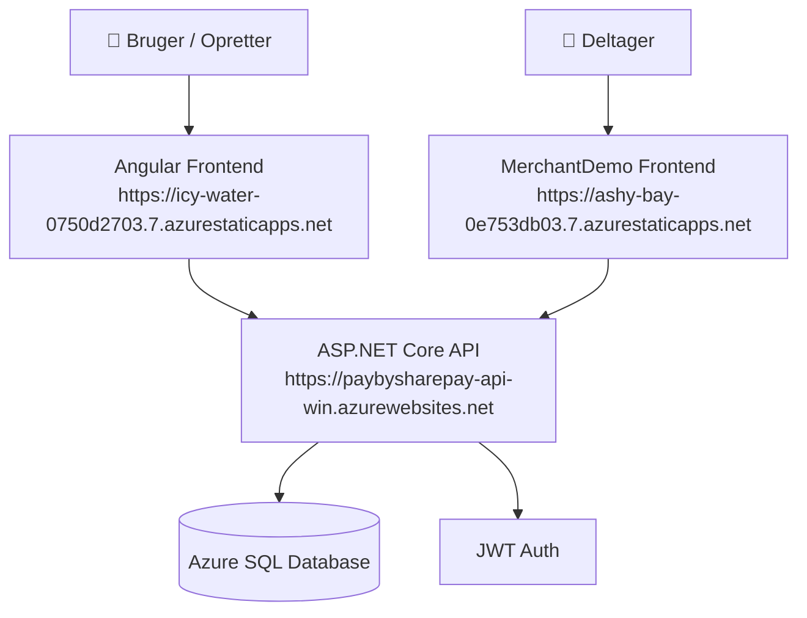

# 01 – Overblik

## Hvad er PayBySharePPay?

**PayBySharePPay** (SBYS) er en webbaseret applikation, der gør det nemmere for grupper af mennesker at dele betalinger og håndtere fælles ordrer – fx pizza-aftener, gruppeindkøb eller fester, hvor én betaler og de andre skal refundere.

Løsningen er lavet som en dansk hverdagsapp med fokus på enkelthed og hurtig onboarding.

---

## Hvilket problem løses?

I dag er det besværligt at koordinere betalinger i grupper:
- Hvem skylder hvad?
- Hvem har betalt?
- Hvordan sender man besked til deltagere om at betale?

PayBySharePPay samler dette i én løsning med ordrestyring, deltagerinvitationer, betalingsregistrering og beskednotifikationer.

---

## Hvem er brugerne?

| Brugertype | Rolle |
|---|---|
| **Opretteren** | Logger ind, opretter ordrer, inviterer deltagere, markerer betalinger |
| **Deltageren** | Modtager link, ser sin del af ordren, registrerer betaling |
| **Merchant** | Kan modtage gruppeordrer og vise et deltagerlink til betalingssiden |

---

## Vigtigste brugerflows

### 1. Opret ordre og inviter deltagere
```
Login → Opret ordre → Tilføj deltagere → Send besked/link → Deltagere betaler
```

### 2. Deltager modtager link
```
Modtager SMS/email-link → Åbner MerchantDemo-siden → Ser sin del → Bekræfter betaling
```

### 3. Overblik og afslutning
```
Overblik over ordre → Se hvem har betalt → Afslut ordre
```

---

## Overordnet systemdiagram



---

## Teknologistack

| Lag | Teknologi |
|---|---|
| Backend API | ASP.NET Core 9, C# |
| Frontend | Angular (TypeScript) |
| Merchant Demo | Vanilla HTML/JS/CSS |
| Database | SQL Server (EF Core, Code First) |
| Authentication | JWT Bearer Tokens |
| Hosting | Azure App Service (API), Azure Static Web Apps (Frontend + MerchantDemo) |
| Database (prod) | Azure SQL Database |
| Deployment | PowerShell script + Azure CLI + SWA CLI |

---

## Hvad kræver systemet for at køre?

- .NET 9 SDK
- Node.js 18+ / npm
- Angular CLI
- SQL Server (lokal) eller Azure SQL (prod)
- Azure CLI + SWA CLI (til deployment)
- Visual Studio 2022/2026 (anbefalet)

---

## Se også

- [Arkitektur](02-arkitektur.md)
- [Projektstruktur](03-projektstruktur.md)
- [Lokal udvikling](10-lokal-udvikling.md)
- [Azure deployment](11-azure-deployment-prod.md)
