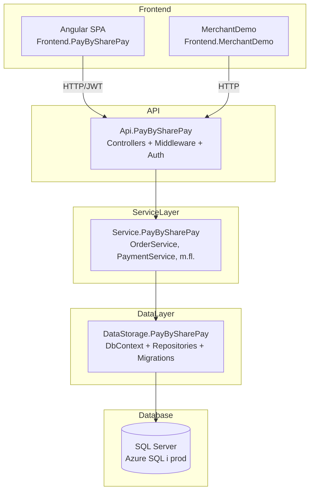
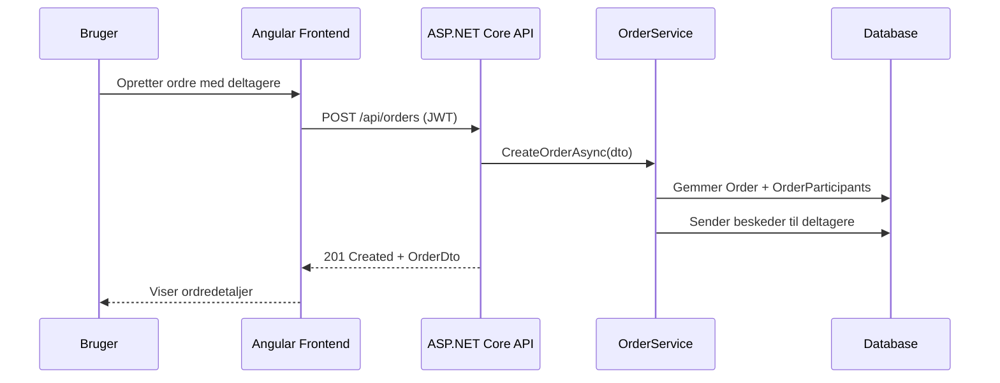
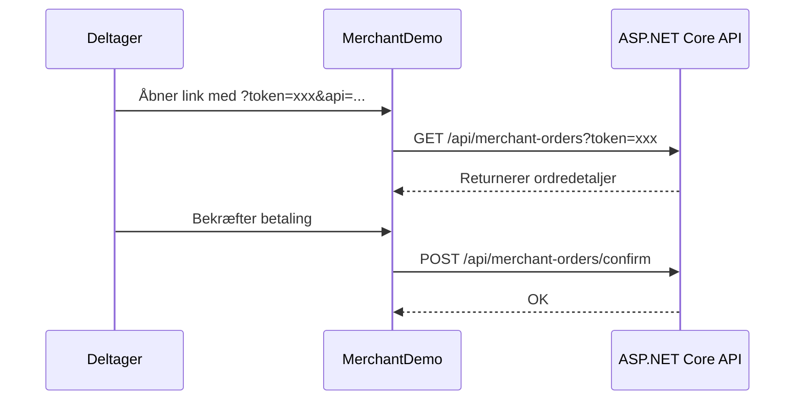
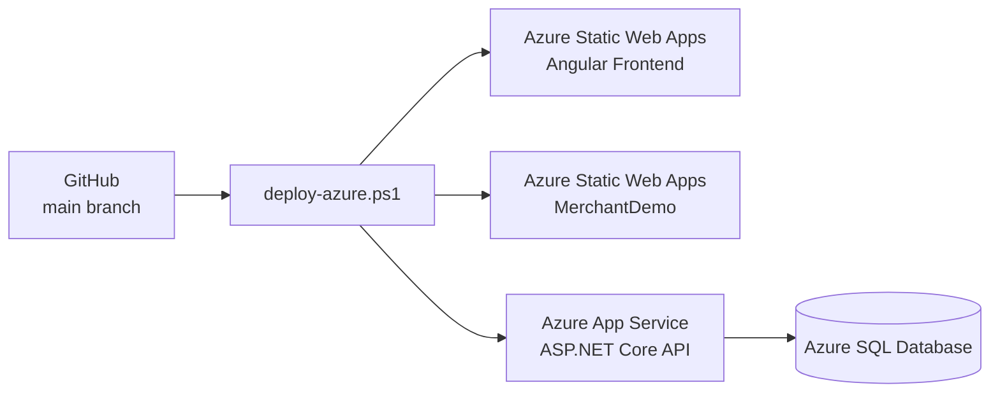

# 02 – Arkitektur

## Arkitekturstil

PayBySharePPay er bygget som en **lagdelt N-tier arkitektur** med klar adskillelse mellem:

- **API-lag** (ASP.NET Core Web API)
- **Service-lag** (forretningslogik)
- **Data Access-lag** (EF Core + repositories)
- **Frontend** (Angular SPA + Vanilla MerchantDemo)

---

## Lagdiagram



---

## Projektafhængigheder

```
Api.PayBySharePay
  ├── Service.PayBySharePay
  │     └── DataStorage.PayBySharePay
  │           └── (EF Core, SQL Server)
  └── (Auth: JWT, Swagger)

Tools.PayBySharePay
  └── DataStorage.PayBySharePay

Tests.PayBySharePay
  └── Service.PayBySharePay
```

---

## Backend/Frontend kommunikation

- Frontend kommunikerer via **HTTPS REST API**.
- JWT-token sendes med som `Authorization: Bearer <token>` header.
- MerchantDemo henter data via **offentligt (unauthenticated) `/api/merchant-orders`** endpoint.
- CORS er konfigureret til specifikke origins (localhost + Azure URLs).

---

## Dataflow – Opret ordre



---

## Dataflow – Deltager betaler via link



---

## Deployment-arkitektur (Produktion)



---

## Sikkerhedsarkitektur

- JWT Bearer authentication på alle `/api/*` endpoints undtagen `/api/merchant-orders` og `/api/auth/*`
- CORS whitelist begrænser adgang fra ukendte origins
- HTTPS påkrævet i produktion (HTTP redirect aktiveret)
- Secrets opbevares i Azure App Service **Application Settings** (ikke i kode)

---

## Arkitekturbeslutninger

| Beslutning | Begrundelse | Konsekvens |
|---|---|---|
| Separat MerchantDemo frontend | Deltagere skal ikke logge ind – enkel HTML/JS | Ingen auth, offentlig URL |
| JWT over cookies | Stateless API, nem integration med SPA | Token skal fornyes/håndteres i frontend |
| EF Core Code First | Hurtig udvikling, migrations i kode | Migration-scripts skal køres manuelt ved prod-deploy |
| Tools.PayBySharePay console app | Fleksibelt seed/flush til dev og prod | Kræver DB-adgang fra devmaskine/CI |
| Azure Static Web Apps | Gratis hosting til SPA/static sites | Begrænset server-side funktionalitet |

---

## Se også

- [Projektstruktur](03-projektstruktur.md)
- [Backend](04-backend.md)
- [Authentication og security](08-authentication-security.md)
- [Azure deployment](11-azure-deployment-prod.md)
