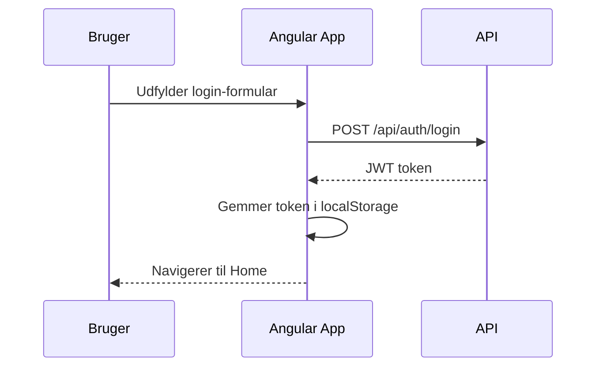

# 05 – Frontend

## Teknologi

| Frontend | Teknologi |
|---|---|
| Primær app | Angular (TypeScript), Angular Router, Angular HttpClient |
| MerchantDemo | Vanilla HTML + CSS + JavaScript (ingen framework) |
| Hosting (prod) | Azure Static Web Apps |

---

## Frontend.PayBySharePay (Angular SPA)

### Sider og features

| Side / Feature | Formål | Mappe |
|---|---|---|
| **Login** | Brugeren logger ind med email og password | `features/login/` |
| **Register** | Ny bruger registrerer sig | `features/register/` |
| **Home** | Dashboard med overblik og genveje | `features/home/` |
| **Opret ordre** | Opret ny ordre med deltagere og besked | `features/create-order/` |
| **Ordreoversigt** | Liste over brugerens ordrer | `features/orders/` |
| **Ordredetaljer** | Detaljer for én ordre: deltagere, betalinger, status | `features/order-detail/` |
| **Beskeder** | Notifikations- og beskedindbakke | `features/messages/` |
| **Find deltagere** | Søg og tilføj deltagere til en ordre | `features/find-participants/` |
| **Afventende deltagere** | Oversigt over deltagere der endnu ikke har betalt | `features/pending-participants/` |
| **Seneste aktivitet** | Oversigt over seneste aktivitet | `features/activity/` |

---

### Vigtige Angular-filer

| Fil | Formål |
|---|---|
| [`app.routes.ts`](../src/Frontend.PayBySharePay/src/app/app.routes.ts) | Routing-konfiguration |
| [`app.component.ts`](../src/Frontend.PayBySharePay/src/app/app.component.ts) | Root app component |
| [`environment.ts`](../src/Frontend.PayBySharePay/src/environments/environment.ts) | Lokal API URL |
| [`environment.prod.ts`](../src/Frontend.PayBySharePay/src/environments/environment.prod.ts) | Prod API URL |

---

### API-kommunikation

Frontend kommunikerer med backend via Angular `HttpClient`.
- JWT-token gemmes i `localStorage` efter login
- Token sendes med som `Authorization: Bearer <token>` header
- API base URL sættes i `environment.ts` / `environment.prod.ts`

**Produktion API URL:**
```
https://paybysharepay-api-win.azurewebsites.net
```

---

### Authentication flow (frontend)



---

### Build og deploy

```powershell
# Byg til produktion
cd src\Frontend.PayBySharePay
npm install
npx ng build --configuration production
```

Output lægges i `dist/frontend.pay-by-share-pay/browser/` og deployes til Azure Static Web Apps.

---

## Frontend.MerchantDemo (Vanilla HTML/JS)

### Formål

Simpel side som deltagere modtager link til – viser ordreindhold og lader deltager bekræfte betaling. Kræver **ikke login**.

### URL og parametre

```
https://ashy-bay-0e753db03.7.azurestaticapps.net?token=<deltager-token>&api=<api-url>
```

| Parameter | Formål |
|---|---|
| `token` | Unik deltager-token til at hente ordredata |
| `api` | API base URL (optional – default: Azure prod API) |

### Filer

| Fil | Formål |
|---|---|
| [`index.html`](../src/Frontend.MerchantDemo/index.html) | Eneste side – henter og viser ordredata |
| [`staticwebapp.config.json`](../src/Frontend.MerchantDemo/staticwebapp.config.json) | Azure Static Web Apps routing-config |
| [`package.json`](../src/Frontend.MerchantDemo/package.json) | Lokal dev-server (`npm start` → port 8081) |

### Lokal dev

```powershell
cd src\Frontend.MerchantDemo
npm install
npm start
# Tilgængelig på: http://localhost:8081
```

---

## UX/UI forbedringer (backlog)

Se [Mangler og UX/UI forbedringer](../README.md#mulige-uiux-forbedringer) i README.

---

## Se også

- [API endpoints](06-api-endpoints.md)
- [Konfiguration](09-konfiguration.md)
- [Screenshots](15-screenshots.md)
