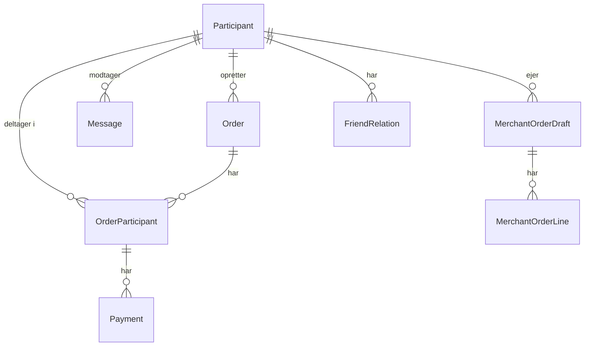

# 07 – Database

## Databasetype

- **SQL Server** (lokal udvikling: SQL Server Express)
- **Azure SQL Database** (produktion)
- ORM: **Entity Framework Core** (Code First, migrations)

---

## DbContext

[`PayBySharePayDbContext`](../src/DataStorage.PayBySharePay/PayBySharePayDbContext.cs)

---

## Entiteter

| Entitet | Beskrivelse | Fil |
|---|---|---|
| `Participant` | Bruger/deltager i systemet | [Participant.cs](../src/DataStorage.PayBySharePay/Entities/Participant.cs) |
| `Order` | En betalingsordre | [Order.cs](../src/DataStorage.PayBySharePay/Entities/Order.cs) |
| `OrderParticipant` | Relation mellem Order og Participant | [OrderParticipant.cs](../src/DataStorage.PayBySharePay/Entities/OrderParticipant.cs) |
| `Payment` | Registreret betaling | [Payment.cs](../src/DataStorage.PayBySharePay/Entities/Payment.cs) |
| `Message` | Besked/notifikation til deltager | [Message.cs](../src/DataStorage.PayBySharePay/Entities/Message.cs) |
| `MerchantOrderDraft` | Merchant-gruppeordre (kladde) | [MerchantOrderDraft.cs](../src/DataStorage.PayBySharePay/Entities/MerchantOrderDraft.cs) |
| `MerchantOrderLine` | Linje i en merchant-gruppeordre | [MerchantOrderLine.cs](../src/DataStorage.PayBySharePay/Entities/MerchantOrderLine.cs) |
| `FriendRelation` | Vennerelation mellem to deltagere | [FriendRelation.cs](../src/DataStorage.PayBySharePay/Entities/FriendRelation.cs) |

---

## ER-diagram (forenklet)



---

## Migrations (historik)

| Migration | Beskrivelse |
|---|---|
| `20260505153849_InitialCreate` | Oprettelse af grundlæggende tabeller |
| `20260506184515_AddOrderCreatedBy` | Tilføjet `CreatedBy` til `Order` |
| `20260506185436_AddMerchantOrderDraft` | Tilføjet `MerchantOrderDraft` og `MerchantOrderLine` |
| `20260508204647_AddMerchantToOrder` | Tilknytning af merchant til ordrer |
| `20260515161555_AddParticipantToOrderLine` | Deltager-relation til ordrelinjer |
| `20260516143930_AddParticipantTokenAndDraftParticipant` | Deltager-token til MerchantDemo-links |
| `20260516151034_AddMessageIsRead` | `IsRead`-felt på `Message` |

---

## Lokal databaseopsætning

```powershell
# Kør migrations lokalt
cd src\Api.PayBySharePay
dotnet ef database update --project ..\DataStorage.PayBySharePay\DataStorage.PayBySharePay.csproj
```

Connection string i `appsettings.json`:
```json
"ConnectionStrings": {
  "PayBySharePayDb": "Server=DESKTOP-xxx\\SQLEXPRESS;Database=PayBySharePay;Trusted_Connection=True;TrustServerCertificate=True"
}
```

---

## Seed og flush (Tools.PayBySharePay)

```powershell
# Lokal seed
cd src\Tools.PayBySharePay
dotnet run -- seed

# Lokal flush (slet alt data)
dotnet run -- flush

# Produktion seed med Azure URLs
dotnet run -- seed --conn "<azure-sql-connection-string>" --merchant-url "https://ashy-bay-0e753db03.7.azurestaticapps.net" --api-url "https://paybysharepay-api-win.azurewebsites.net"
```

---

## Produktion databaseopsætning

1. **Azure SQL Database** er oprettet i Azure
2. Connection string sættes i **Azure App Service Application Settings** (ikke i kode!)
3. Migrations køres via:

```powershell
dotnet ef database update --configuration Release --project src\DataStorage.PayBySharePay\DataStorage.PayBySharePay.csproj --startup-project src\Api.PayBySharePay\Api.PayBySharePay.csproj
```

> ⚠️ **Vigtigt:** Migrations må **ikke** køres automatisk på startup i produktion. Kør dem manuelt inden deployment.

---

## Se også

- [Backend](04-backend.md)
- [Konfiguration](09-konfiguration.md)
- [Azure deployment](11-azure-deployment-prod.md)
