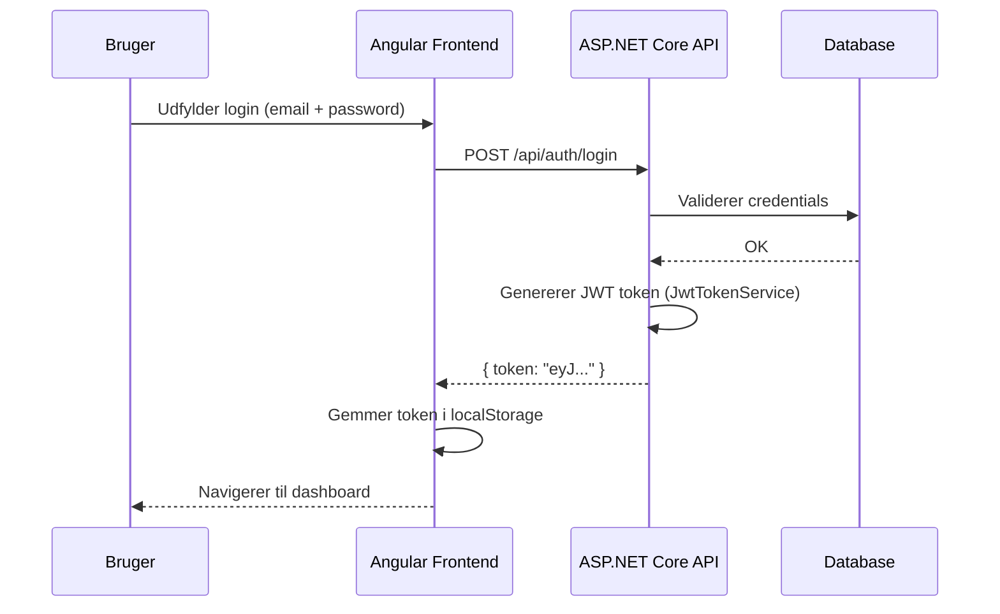

# 08 – Authentication og Security

## Authentication-type

**JWT Bearer Tokens** (JSON Web Tokens)

- Tokens genereres ved login via `AuthController`
- Token signeres med en hemmelig nøgle (`Jwt:Key`)
- Token valideres på hvert kald til beskyttede endpoints
- Token udløber efter konfigureret tid (`Jwt:ExpiresInMinutes`)

---

## Login-flow

---

## Authorization

- Alle API-endpoints er beskyttet med `[Authorize]`
- **Undtaget:** `/api/auth/*` og `/api/merchant-orders` (offentlig adgang til deltagerflow)
- Ingen rollebaseret authorization i nuværende implementation (alle autentificerede brugere har samme adgang)

---

## JWT-konfiguration

| Nøgle | Beskrivelse |
|---|---|
| `Jwt:Key` | Hemmelig signeringsnøgle (min. 32 tegn) |
| `Jwt:Issuer` | Token-udsteder (`sbys-api`) |
| `Jwt:Audience` | Token-modtager (`sbys-frontend`) |
| `Jwt:ExpiresInMinutes` | Token-varighed (standard: 43200 = 30 dage) |

> ⚠️ **Jwt:Key i `appsettings.json` er KUN til lokal udvikling.** I produktion sættes den via Azure App Service Application Settings.

---

## CORS

CORS-policy `Frontend` tillader følgende origins:

| Origin | Formål |
|---|---|
| `http://localhost:4200` | Angular dev-server |
| `http://localhost:8081` | MerchantDemo dev-server |
| `https://icy-water-0750d2703.7.azurestaticapps.net` | Angular SPA (prod) |
| `https://ashy-bay-0e753db03.7.azurestaticapps.net` | MerchantDemo (prod) |
| `https://paybysharepay.dk` | Custom domain (fremtidigt) |
| `https://www.paybysharepay.dk` | Custom domain (fremtidigt) |

---

## HTTPS

- HTTPS påkrævet i produktion (Azure App Service terminerer TLS)
- Lokalt: HTTP-redirect deaktiveret i Development (`UseHttpsRedirection` aktiveres kun i non-dev)

---

## Security Checklist

| Område | Status | Kommentar |
|---|---|---|
| HTTPS i prod | ✅ OK | Azure App Service håndterer TLS |
| JWT authentication | ✅ OK | Bearer tokens på alle beskyttede endpoints |
| Secrets i repo | ⚠️ Delvist | Dev-key i `appsettings.json` – se nedenfor |
| Authorization/roller | ⚠️ Mangler | Ingen rollebaseret adgangskontrol |
| CORS whitelist | ✅ OK | Specifikke origins, ikke wildcard |
| Input validering | ⚠️ Delvist | Modelvalidering, men ingen dybde-validering |
| Rate limiting | ❌ Mangler | Ingen rate limiting implementeret |
| Azure Key Vault | ❌ Mangler | Secrets håndteres via App Service Settings, ikke Key Vault |
| Audit logging | ❌ Mangler | Ingen audit trail |
| Refresh tokens | ❌ Mangler | Lang token-varighed (30 dage) kompenserer, men er en risiko |

---

## Kendte sikkerhedsrisici

1. **Dev JWT-nøgle i `appsettings.json`** – Nøglen `"SBYS-DEV-SECRET-REPLACE-IN-PRODUCTION-MIN-32-CHARS"` må aldrig bruges i prod. Prod-nøglen skal sættes i Azure App Service Settings.

2. **Lang token-varighed (30 dage)** – Brug evt. kortere varighed + refresh tokens i en fremtidig version.

3. **Ingen rollekontrol** – Alle autentificerede brugere kan potentielt tilgå andres data, hvis endpoints ikke validerer ejerskab.

4. **Ingen rate limiting** – Login-endpoint er ikke beskyttet mod brute force.

---

## Se også

- [Konfiguration](09-konfiguration.md)
- [Azure deployment](11-azure-deployment-prod.md)
