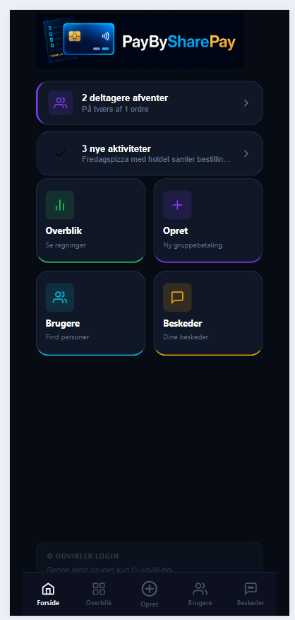
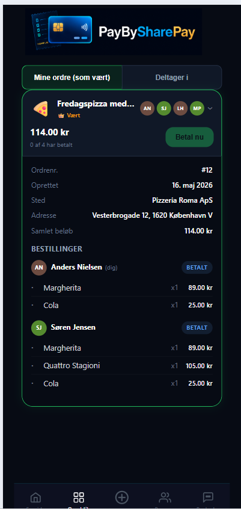
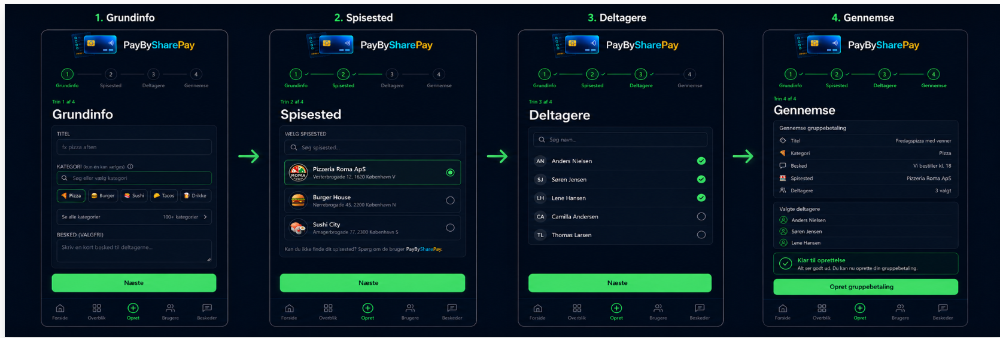
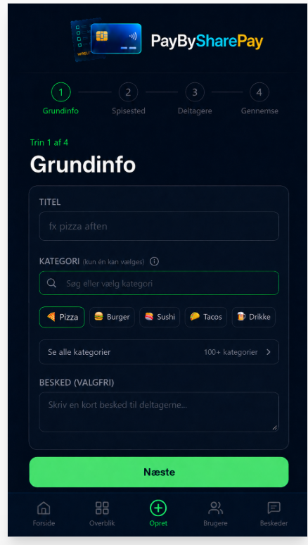
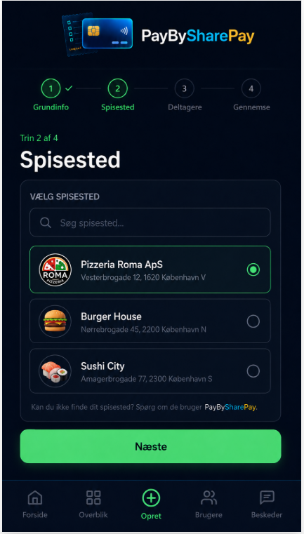
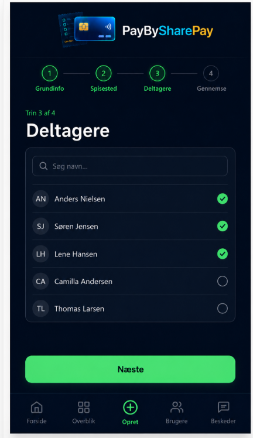
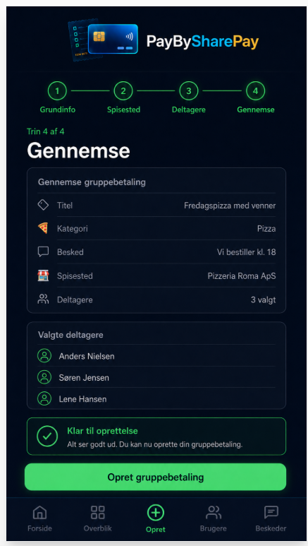
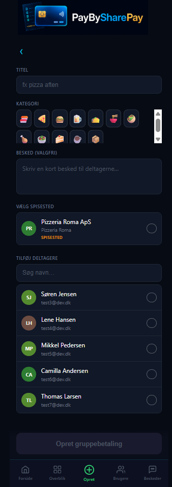
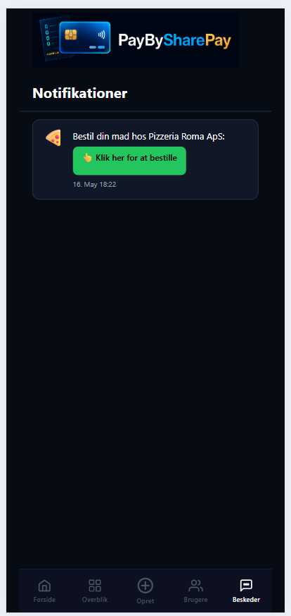

# 15 – Screenshots

Screenshots er gemt i `docs/images/`.

---

## Forside / Dashboard

*Forsiden viser brugerens dashboard med overblik over aktive ordrer og genveje.*

---

## Overblik

*Overblikssiden med ordrestatus og betalingsoversigt.*

---

## Opret ordre – wizard flow (alle 4 trin)

*Det fulde 4-trins wizard-flow: Grundinfo → Spisested → Deltagere → Gennemse.*

### Trin 1 – Grundinfo

*Trin 1: Titel, kategori og valgfri besked til deltagerne.*

### Trin 2 – Spisested

*Trin 2: Vælg spisested fra listen.*

### Trin 3 – Deltagere

*Trin 3: Søg og vælg deltagere til ordren.*

### Trin 4 – Gennemse

*Trin 4: Gennemse alle valg og opret gruppebetaling.*

### Samlet opret-ordre visning

*Samlet visning af opret-ordre flowet.*

---

## Beskeder

*Beskedindbakken med notifikationer og links til ordrer.*

---

## TODO: Screenshots der mangler

| Screenshot | Filnavn | Beskrivelse |
|---|---|---|
| Login-side | `docs/images/01-login.png` | Login-formular med email og password |
| Ordredetaljer | `docs/images/05-order-detail.png` | Detaljeret visning af en ordre |
| Find deltagere | `docs/images/07-find-participants.png` | Søg og tilføj deltagere |
| Afventende deltagere | `docs/images/08-pending-participants.png` | Deltagere der endnu ikke har betalt |
| MerchantDemo | `docs/images/09-merchant-demo.png` | Deltagerens betalingsside (åbn med test-token) |
| Seneste aktivitet | `docs/images/10-activity.png` | Aktivitetsoversigt |

### Sådan tager du de manglende screenshots

1. Start løsningen lokalt (se [Lokal udvikling](10-lokal-udvikling.md))
2. Naviger til den ønskede side
3. Tag screenshot med `Win + Shift + S` eller Snipping Tool
4. Gem i `docs/images/` med det angivne filnavn
5. Fjern rækken fra TODO-tabellen ovenfor

