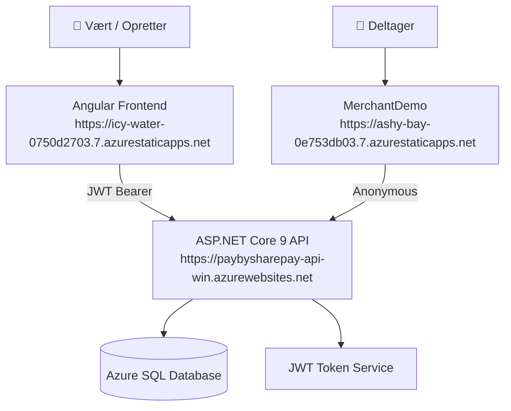

# PayBySharePPay – Komplet Dokumentation

> **Sprog:** Dansk  
> **Sidst opdateret:** Maj 2026  
> **Repository:** [mickni38-svg/PayBySharePPay](https://github.com/mickni38-svg/PayBySharePPay)

---

## Indholdsfortegnelse

1. [Hvad er PayBySharePPay?](#1-hvad-er-paybysharepay)
2. [Hvem bruger systemet?](#2-hvem-bruger-systemet)
3. [Brugerflows – trin for trin](#3-brugerflows--trin-for-trin)
   - 3.1 [Opret konto og log ind](#31-opret-konto-og-log-ind)
   - 3.2 [Opret en ordre og inviter deltagere](#32-opret-en-ordre-og-inviter-deltagere)
   - 3.3 [Deltager modtager link og bestiller](#33-deltager-modtager-link-og-bestiller)
   - 3.4 [Vært ser overblik og gennemfører betaling](#34-vært-ser-overblik-og-gennemfører-betaling)
   - 3.5 [Beskeder og notifikationer](#35-beskeder-og-notifikationer)
4. [Systemarkitektur](#4-systemarkitektur)
   - 4.1 [Overordnet diagram](#41-overordnet-diagram)
   - 4.2 [Lagdeling](#42-lagdeling)
   - 4.3 [Teknologistack](#43-teknologistack)
5. [Projektstruktur](#5-projektstruktur)
6. [Backend – API og services](#6-backend--api-og-services)
   - 6.1 [Autentificering (Auth)](#61-autentificering-auth)
   - 6.2 [Ordrer (Orders)](#62-ordrer-orders)
   - 6.3 [MerchantOrders – gruppebestilling hos forhandler](#63-merchantorders--gruppebestilling-hos-forhandler)
   - 6.4 [Betalinger (Payments)](#64-betalinger-payments)
   - 6.5 [Deltagere (Participants)](#65-deltagere-participants)
   - 6.6 [Beskeder (Messages)](#66-beskeder-messages)
   - 6.7 [Venner (Friends)](#67-venner-friends)
   - 6.8 [Directory – søg efter brugere](#68-directory--søg-efter-brugere)
7. [API Endpoints – komplet oversigt](#7-api-endpoints--komplet-oversigt)
8. [Database og datamodel](#8-database-og-datamodel)
   - 8.1 [Entiteter](#81-entiteter)
   - 8.2 [Ordrestatus-flow](#82-ordrestatus-flow)
9. [Frontend – Angular og MerchantDemo](#9-frontend--angular-og-merchantdemo)
   - 9.1 [Angular-applikationen](#91-angular-applikationen)
   - 9.2 [MerchantDemo-siden](#92-merchantdemo-siden)
10. [Autentificering og sikkerhed](#10-autentificering-og-sikkerhed)
11. [Konfiguration og miljøvariabler](#11-konfiguration-og-miljøvariabler)
12. [Lokal udvikling – kom i gang](#12-lokal-udvikling--kom-i-gang)
13. [Deployment til Azure](#13-deployment-til-azure)
14. [Test](#14-test)
15. [Kendte mangler og roadmap](#15-kendte-mangler-og-roadmap)
16. [Links til vigtige filer](#16-links-til-vigtige-filer)

---

## 1. Hvad er PayBySharePPay?

**PayBySharePPay** (forkortet SBYS) er en dansk webapplikation, der løser et velkendt hverdagsproblem: *Hvem betaler hvad, når man er en gruppe?*

Forestil dig at du og fire venner vil bestille pizza. Én person betaler den samlede regning, og de andre skal bagefter betale deres del. Med PayBySharePPay kan du som vært:

- **Oprette en gruppe-ordre** og tilknytte spisestedet
- **Sende et bestillingslink** til hver deltager via beskedsystemet
- **Se i realtid** hvem der har bestilt og hvem der endnu ikke har
- **Holde styr på betalingerne** – hvem har betalt, og hvem mangler

Deltagerne behøver **ikke at oprette en konto** for at bestille og betale. De modtager blot et link og kan gøre det hele derfra.

---

## 2. Hvem bruger systemet?

Systemet er designet til tre typer brugere:

| Brugertype | Hvem er det? | Hvad gør de? |
|---|---|---|
| **Vært / Opretter** | Den person der arrangerer fx en pizzaaften | Logger ind, opretter ordren, inviterer deltagere, følger op på betalinger |
| **Deltager** | De andre i gruppen | Modtager et link, ser menuen, bestiller og betaler – uden at oprette konto |
| **Merchant (forhandler)** | Spisestedet, fx en pizzeria | Har en betalingsside (MerchantDemo) som viser menuen og modtager bestillinger |

---

## 3. Brugerflows – trin for trin

### 3.1 Opret konto og log ind

Før du kan oprette ordrer, skal du have en konto.

**Som ny bruger:**
1. Gå til appen og klik **"Opret konto"**
2. Udfyld navn, e-mail og telefonnummer
3. Du er nu logget ind og klar til at bruge systemet

**Som eksisterende bruger:**
1. Gå til appen og klik **"Log ind"**
2. Indtast din e-mail
3. Du modtager en JWT-token som holder dig logget ind i 8 timer

> 💡 **Bemærk:** I den nuværende MVP-version kræves der ikke et kodeord. Login sker blot ved at angive en kendt e-mailadresse. Dette er en planlagt forbedring.

---

### 3.2 Opret en ordre og inviter deltagere

Når du er logget ind, kan du oprette en ny ordre via en 4-trins wizard:

```
Trin 1: Grundinfo       → Titel og kategori (fx "Pizza fredag")
Trin 2: Vælg spisested  → Søg efter og vælg en merchant (fx Pizzeria Roma)
Trin 3: Tilføj deltagere → Søg efter brugere og tilføj dem
Trin 4: Gennemse        → Bekræft og opret ordren
```

Systemet sender automatisk et **unikt bestillingslink** til alle deltagere i beskedindbakken, så snart ordren er oprettet.

---

### 3.3 Deltager modtager link og bestiller

Deltagerens oplevelse er designet til at være så nem som muligt:

1. Deltager modtager et link via indbakken (f.eks. `https://spisestedet.dk?orderId=5&participantToken=abc123`)
2. Klikker på linket og åbner **MerchantDemo-siden** – spisestedets bestillingsside
3. Ser menuen og tilføjer de ønskede varer til kurven
4. Bekræfter bestillingen – ingen konto påkrævet

Bag kulisserne registrerer systemet bestillingen som en `MerchantOrderDraft`, og deltagerens status opdateres til `OrderSubmitted`.

Når **alle** deltagere har bestilt, skifter ordren automatisk til status `ReadyToPay`.

---

### 3.4 Vært ser overblik og gennemfører betaling

Tilbage i Angular-appen kan værten:

1. Åbne ordren og se **overblikket**: hvem har bestilt hvad, og hvem har betalt
2. Se en liste over alle deltagende og deres betalingsstatus
3. Klikke **"Gennemfør betaling"** når ordren er klar (`ReadyToPay`)
4. Ordren skifter status til `Completed`

Betalinger registreres manuelt via `POST /api/payments` – der er endnu ingen integration til betalingsudbydere som MobilePay eller Stripe.

---

### 3.5 Beskeder og notifikationer

Systemet har et simpelt beskedsystem:

- Ved ordreoprettelse sendes automatisk et bestillingslink til hver deltager
- Beskeder vises i brugerens indbakke under "Beskeder"
- Beskeder kan markeres som læste

---

## 4. Systemarkitektur

### 4.1 Overordnet diagram



### 4.2 Lagdeling

Systemet følger en klassisk N-tier arkitektur:

```
┌──────────────────────────────────────────────────────┐
│  Præsentationslag   Angular Frontend + MerchantDemo  │
├──────────────────────────────────────────────────────┤
│  API-lag            ASP.NET Core Controllers         │
├──────────────────────────────────────────────────────┤
│  Servicelag         Business logic (OrderService,    │
│                     PaymentService, osv.)             │
├──────────────────────────────────────────────────────┤
│  Datalag            Repositories + EF Core           │
├──────────────────────────────────────────────────────┤
│  Database           Azure SQL / SQL Server           │
└──────────────────────────────────────────────────────┘
```

Hvert lag kommunikerer kun med laget direkte under det. Controllers kalder kun services. Services kalder kun repositories. Repositories taler med databasen via Entity Framework Core.

### 4.3 Teknologistack

| Lag | Teknologi | Version |
|---|---|---|
| Backend API | ASP.NET Core, C# | .NET 9 |
| ORM | Entity Framework Core | 9 |
| Frontend | Angular (TypeScript) | 18+ |
| MerchantDemo | Vanilla HTML/CSS/JavaScript | – |
| Database | SQL Server / Azure SQL | – |
| Autentificering | JWT Bearer Tokens | – |
| Hosting (API) | Azure App Service (Windows) | – |
| Hosting (Frontend) | Azure Static Web Apps | – |
| Deployment | PowerShell + Azure CLI + SWA CLI | – |

---

## 5. Projektstruktur

```
PayBySharePPay/
├── src/
│   ├── Api.PayBySharePay/          ← ASP.NET Core Web API
│   │   ├── Controllers/            ← HTTP endpoints
│   │   ├── Auth/                   ← JWT token service
│   │   ├── DTOs/                   ← Request-modeller (input)
│   │   ├── Middleware/             ← Global fejlhåndtering
│   │   ├── Services/               ← Hosted services (dev)
│   │   └── Program.cs              ← App-konfiguration og startup
│   │
│   ├── Service.PayBySharePay/      ← Forretningslogik
│   │   ├── Services/               ← OrderService, PaymentService, osv.
│   │   ├── Interfaces/             ← Kontrakter (IOrderService, osv.)
│   │   ├── DTOs/                   ← Data Transfer Objects (output)
│   │   └── Extensions/             ← DI-registrering
│   │
│   ├── DataStorage.PayBySharePay/  ← Database-adgang
│   │   ├── Context/                ← DbContext (EF Core)
│   │   ├── Entities/               ← Databaseentiteter
│   │   ├── Repositories/           ← Datahentning
│   │   ├── Migrations/             ← EF Core migrations
│   │   └── Extensions/             ← DI-registrering
│   │
│   ├── Frontend.PayBySharePay/     ← Angular-app
│   │   └── src/app/
│   │       ├── core/               ← Auth, guards, interceptors
│   │       ├── features/           ← Sider (login, orders, messages...)
│   │       ├── layout/             ← Shell, navigation
│   │       └── shared/             ← Delte komponenter
│   │
│   ├── Frontend.MerchantDemo/      ← Deltager-betalingsside (Vanilla JS)
│   │   └── index.html
│   │
│   ├── Tests.PayBySharePay/        ← Enhedstest
│   └── Tools.PayBySharePay/        ← Seed/flush-konsolapp
│
├── docs/                           ← Dokumentation
├── deploy-azure.ps1                ← Deployment til Azure (prod)
├── deploy-test.ps1                 ← Deployment til testmiljø
└── PayBySharePay.sln               ← Visual Studio solution
```

---

## 6. Backend – API og services

API'en er bygget med ASP.NET Core 9. Alle controllers arver fra `ControllerBase` og er annoteret med `[ApiController]`. De fleste endpoints kræver en JWT-token i `Authorization`-headeren.

### 6.1 Autentificering (Auth)

**Controller:** [`AuthController.cs`](../src/Api.PayBySharePay/Controllers/AuthController.cs)  
**Service:** [`ParticipantService.cs`](../src/Service.PayBySharePay/Services/ParticipantService.cs)  
**Token:** [`JwtTokenService.cs`](../src/Api.PayBySharePay/Auth/JwtTokenService.cs)

#### Login-flow

```
POST /api/auth/login
   │
   ├── Slår e-mail op i Participants-tabellen
   ├── Finder person af typen "Person"
   ├── Genererer JWT-token (gyldigt 8 timer)
   └── Returnerer token + participantId + navn
```

**Eksempel – login request:**
```http
POST /api/auth/login
Content-Type: application/json

{
  "email": "mads@example.com"
}
```

**Eksempel – login response:**
```json
{
  "token": "eyJhbGciOiJIUzI1NiIsInR5cCI6IkpXVCJ9...",
  "participantId": 3,
  "name": "Mads",
  "expiresAt": "2026-05-23T18:00:00Z"
}
```

#### Registrering – ny person

```http
POST /api/auth/register
Content-Type: application/json

{
  "name": "Mads Hansen",
  "email": "mads@example.com",
  "phone": "12345678"
}
```

**Returnerer:** `201 Created` med samme format som login-response.

#### Registrering – merchant (spisested)

```http
POST /api/auth/register-merchant
Content-Type: application/json

{
  "name": "Pizzeria Roma",
  "companyName": "Roma ApS",
  "cvrNumber": "12345678",
  "contactPerson": "Giovanni",
  "contactEmail": "giovanni@pizzeriaroma.dk",
  "contactPhone": "87654321",
  "companyAddress": "Strøget 1, 1000 København"
}
```

---

### 6.2 Ordrer (Orders)

**Controller:** [`OrdersController.cs`](../src/Api.PayBySharePay/Controllers/OrdersController.cs)  
**Service:** [`OrderService.cs`](../src/Service.PayBySharePay/Services/OrderService.cs)  
**Interface:** [`IOrderService.cs`](../src/Service.PayBySharePay/Interfaces/IOrderService.cs)

Alle endpoints kræver `[Authorize]` – dvs. en gyldig JWT-token.

#### Opret ordre

Opretter en ny ordre og tildeler automatisk:
- Et unikt `JoinToken` til ordren
- Et unikt `ParticipantToken` til **hver** deltager
- Status = `"Collecting"` (samler ind)
- Automatiske besked-links til alle deltagere, hvis merchant er tilknyttet

```
POST /api/orders
   │
   ├── Validerer titlen
   ├── Henter opretter og merchant fra databasen
   ├── Genererer JoinToken (GUID)
   ├── Tilføjer opretter som accepteret deltager
   ├── Tilføjer øvrige deltagere som "Invited"
   ├── Gemmer ordren i databasen
   ├── Sender bestillingslinks til alle deltagere (via Messages)
   └── Returnerer OrderDto
```

**Request:**
```http
POST /api/orders
Authorization: Bearer eyJ...
Content-Type: application/json

{
  "createdByParticipantId": 3,
  "title": "Pizza fredag",
  "category": "Mad",
  "message": "Vi spiser pizza kl. 18!",
  "merchantParticipantId": 7,
  "participantIds": [3, 4, 5, 6]
}
```

**Response (201 Created):**
```json
{
  "id": 12,
  "createdByParticipantId": 3,
  "title": "Pizza fredag",
  "category": "Mad",
  "message": "Vi spiser pizza kl. 18!",
  "status": "Collecting",
  "createdAt": "2026-05-23T10:30:00Z"
}
```

#### Hent ordrer

```http
GET /api/orders
Authorization: Bearer eyJ...
```

Filtrer på deltager:
```http
GET /api/orders?participantId=3
```

#### Ordredetaljer og overblik

```http
GET /api/orders/12/overview
Authorization: Bearer eyJ...
```

Returnerer `OrderOverviewDto` med:
- Alle deltagere og deres status
- Betalingsstatus pr. deltager
- Ordrelinjer pr. deltager (hvad de har bestilt)
- Beskeder knyttet til ordren

#### Afslut ordre

Kræver at ordren er i status `ReadyToPay` og at den anmodende deltager er opretteren.

```http
POST /api/orders/12/complete
Authorization: Bearer eyJ...
Content-Type: application/json

{
  "requestingParticipantId": 3
}
```

**Ordrestatus-overgang:** `ReadyToPay` → `Completed`

Se den relevante kode i [`OrderService.CompleteOrderAsync`](../src/Service.PayBySharePay/Services/OrderService.cs).

---

### 6.3 MerchantOrders – gruppebestilling hos forhandler

**Controller:** [`MerchantOrdersController.cs`](../src/Api.PayBySharePay/Controllers/MerchantOrdersController.cs)  
**Service:** [`MerchantOrderService.cs`](../src/Service.PayBySharePay/Services/MerchantOrderService.cs)

Dette er det flow, der håndterer deltagerens bestilling via MerchantDemo. Disse endpoints er **åbne** (ingen JWT kræves), da deltagerne ikke har en konto.

#### Init order (deltager indsender bestilling)

```
POST /api/merchant-orders
   │
   ├── Valider ordreId og merchantId
   ├── Valider participantToken (unikt link til deltager)
   ├── Opret eller erstat eksisterende draft
   ├── Gem ordrelinjer med ParticipantId
   ├── Sæt deltagerens OrderParticipant.Status = "OrderSubmitted"
   ├── Tjek om alle deltagere har bestilt
   │   └── Hvis ja: sæt ordre.Status = "ReadyToPay"
   └── Returnerer MerchantOrderDraftDto
```

**Request:**
```http
POST /api/merchant-orders
Content-Type: application/json

{
  "orderId": 12,
  "merchantParticipantId": 7,
  "participantToken": "abc123def456",
  "merchantDraftReference": "DRAFT-001",
  "subtotalAmount": 120.00,
  "totalAmount": 130.00,
  "currency": "DKK",
  "paymentMode": "GroupPay",
  "expiresAtUtc": "2026-05-24T10:00:00Z",
  "lines": [
    {
      "lineId": "L1",
      "name": "Margherita",
      "quantity": 1,
      "unitPrice": 120.00,
      "lineTotal": 120.00
    }
  ]
}
```

**Response (201 Created):**
```json
{
  "id": 5,
  "orderId": 12,
  "merchantParticipantId": 7,
  "status": "Submitted",
  "totalAmount": 130.00,
  "currency": "DKK",
  "lines": [...]
}
```

#### Hent merchant order draft

```http
GET /api/merchant-orders/by-order/12
Authorization: Bearer eyJ...
```

---

### 6.4 Betalinger (Payments)

**Controller:** [`PaymentsController.cs`](../src/Api.PayBySharePay/Controllers/PaymentsController.cs)  
**Service:** [`PaymentService.cs`](../src/Service.PayBySharePay/Services/PaymentService.cs)

Registrerer en betaling for en deltager i en ordre. Betalingen sættes umiddelbart til status `Completed`.

```http
POST /api/payments
Content-Type: application/json

{
  "orderId": 12,
  "participantId": 4,
  "amount": 130.00
}
```

**Response (201 Created):**
```json
{
  "id": 8,
  "participantId": 4,
  "participantName": "Søren",
  "amount": 130.00,
  "status": "Completed",
  "createdAt": "2026-05-23T18:45:00Z"
}
```

Se [`PaymentService.RegisterPaymentAsync`](../src/Service.PayBySharePay/Services/PaymentService.cs) for implementering.

---

### 6.5 Deltagere (Participants)

**Controller:** [`ParticipantsController.cs`](../src/Api.PayBySharePay/Controllers/ParticipantsController.cs)  
**Service:** [`ParticipantService.cs`](../src/Service.PayBySharePay/Services/ParticipantService.cs)

```http
GET  /api/participants           ← Hent alle
POST /api/participants           ← Opret ny
GET  /api/participants/{id}      ← Hent én
```

---

### 6.6 Beskeder (Messages)

**Controller:** [`MessagesController.cs`](../src/Api.PayBySharePay/Controllers/MessagesController.cs)  
**Service:** [`MessageService.cs`](../src/Service.PayBySharePay/Services/MessageService.cs)

```http
GET /api/messages                   ← Hent beskeder for den indloggede bruger
POST /api/messages                  ← Send en besked
PUT  /api/messages/{id}/read        ← Markér som læst
```

Beskeder oprettes automatisk af [`OrderService.CreateOrderAsync`](../src/Service.PayBySharePay/Services/OrderService.cs) når en ordre oprettes med en merchant.

---

### 6.7 Venner (Friends)

**Controller:** [`FriendsController.cs`](../src/Api.PayBySharePay/Controllers/FriendsController.cs)

```http
GET  /api/friends        ← Hent venneliste
POST /api/friends        ← Tilføj ven
```

---

### 6.8 Directory – søg efter brugere

**Controller:** [`DirectoryController.cs`](../src/Api.PayBySharePay/Controllers/DirectoryController.cs)  
**Service:** [`DirectoryService.cs`](../src/Service.PayBySharePay/Services/DirectoryService.cs)

Bruges i Angular-appen når man søger efter deltagere at tilføje til en ordre.

```http
GET /api/directory?search=mads
Authorization: Bearer eyJ...
```

---

## 7. API Endpoints – komplet oversigt

| Metode | Endpoint | Auth | Beskrivelse |
|---|---|---|---|
| POST | `/api/auth/login` | ❌ | Log ind og få JWT |
| POST | `/api/auth/register` | ❌ | Opret ny brugerkonto |
| POST | `/api/auth/register-merchant` | ❌ | Opret merchant-konto |
| GET | `/api/orders` | ✅ | Hent alle ordrer (filtrerbar) |
| POST | `/api/orders` | ✅ | Opret ny ordre |
| GET | `/api/orders/{id}/overview` | ✅ | Ordredetaljer med betalingsstatus |
| POST | `/api/orders/{id}/complete` | ✅ | Afslut ordre |
| POST | `/api/merchant-orders` | ❌ | Deltager indsender bestilling |
| GET | `/api/merchant-orders/by-order/{orderId}` | ✅ | Hent merchant draft |
| POST | `/api/payments` | ❌ | Registrer betaling |
| GET | `/api/participants` | ✅ | Hent alle deltagere |
| POST | `/api/participants` | ✅ | Opret deltager |
| GET | `/api/participants/{id}` | ✅ | Hent én deltager |
| GET | `/api/messages` | ✅ | Hent beskeder |
| POST | `/api/messages` | ✅ | Send besked |
| PUT | `/api/messages/{id}/read` | ✅ | Markér besked som læst |
| GET | `/api/friends` | ✅ | Hent venneliste |
| POST | `/api/friends` | ✅ | Tilføj ven |
| GET | `/api/directory?search=` | ✅ | Søg efter brugere |

> ✅ = JWT Bearer token krævet, ❌ = åbent endpoint

**Swagger UI (lokalt):** `https://localhost:7071/swagger`  
**Swagger UI (Azure):** `https://paybysharepay-api-win.azurewebsites.net/swagger`

---

## 8. Database og datamodel

### 8.1 Entiteter

Databasen er defineret via Entity Framework Core (Code First) og består af følgende entiteter:

#### `Participant` – brugere og forhandlere

Samler alle parter i systemet i én tabel. Typen skelnes via `ParticipantType`-enum.

```csharp
// Entitet: src/DataStorage.PayBySharePay/Entities/Participant.cs
public class Participant
{
    public int Id { get; set; }
    public ParticipantType Type { get; set; }   // Person, Merchant
    public string Name { get; set; }
    public string? Email { get; set; }
    public string? Phone { get; set; }

    // Merchant-specifikke felter
    public string? CompanyName { get; set; }
    public string? CvrNumber { get; set; }
    public string? ContactEmail { get; set; }
    public string? CompanyAddress { get; set; }
    public string? GroupOrderUrl { get; set; }  // MerchantDemo-URL til bestillingssiden
    // ...
}
```

#### `Order` – en gruppeordre

```csharp
// Entitet: src/DataStorage.PayBySharePay/Entities/Order.cs
public class Order
{
    public int Id { get; set; }
    public int CreatedByParticipantId { get; set; }
    public string Title { get; set; }
    public string? Category { get; set; }
    public string Status { get; set; }          // "Collecting" | "ReadyToPay" | "Completed"
    public int? MerchantParticipantId { get; set; }
    public string? JoinToken { get; set; }      // Unikt token til ordren

    public ICollection<OrderParticipant> OrderParticipants { get; set; }
    public ICollection<Payment> Payments { get; set; }
    public ICollection<Message> Messages { get; set; }
    public ICollection<MerchantOrderDraft> MerchantOrderDrafts { get; set; }
}
```

#### `OrderParticipant` – relation mellem deltager og ordre

```csharp
public class OrderParticipant
{
    public int OrderId { get; set; }
    public int ParticipantId { get; set; }
    public string Status { get; set; }          // "Invited" | "Accepted" | "OrderSubmitted"
    public string? ParticipantToken { get; set; } // Unikt link-token til denne deltager
}
```

#### `Payment` – betaling registreret

```csharp
public class Payment
{
    public int Id { get; set; }
    public int OrderId { get; set; }
    public int ParticipantId { get; set; }
    public decimal Amount { get; set; }
    public string Status { get; set; }          // "Pending" | "Completed"
    public DateTime CreatedAt { get; set; }
}
```

#### `MerchantOrderDraft` – deltagers bestilling hos forhandler

```csharp
public class MerchantOrderDraft
{
    public int Id { get; set; }
    public int OrderId { get; set; }
    public int MerchantParticipantId { get; set; }
    public int? ParticipantId { get; set; }     // Hvilken deltager bestillingen tilhører
    public decimal TotalAmount { get; set; }
    public string Currency { get; set; }
    public string Status { get; set; }          // "Submitted"
    public ICollection<MerchantOrderLine> Lines { get; set; }
}
```

#### `Message` – besked i indbakken

```csharp
public class Message
{
    public int Id { get; set; }
    public int OrderId { get; set; }
    public int ParticipantId { get; set; }
    public string Content { get; set; }
    public bool IsRead { get; set; }
    public DateTime CreatedAt { get; set; }
}
```

#### `FriendRelation` – venneforbindelser

```csharp
public class FriendRelation
{
    public int InitiatorId { get; set; }
    public int ReceiverId { get; set; }
    public string Status { get; set; }
}
```

### 8.2 Ordrestatus-flow

En ordre gennemgår følgende statusser i sin levetid:

```
Oprettet
    │
    ▼
"Collecting"          ← Deltagere modtager link og bestiller
    │
    │  (alle har bestilt)
    ▼
"ReadyToPay"          ← Vært kan nu gennemføre betalingen
    │
    │  (vært kalder /complete)
    ▼
"Completed"           ← Ordren er afsluttet
```

Overgangen fra `Collecting` til `ReadyToPay` sker automatisk i
[`OrderService.CheckAndSetReadyToPayAsync`](../src/Service.PayBySharePay/Services/OrderService.cs),
som kaldes efter hvert deltager-indsend i [`MerchantOrderService.InitOrderAsync`](../src/Service.PayBySharePay/Services/MerchantOrderService.cs).

**Deltager-statusser** (`OrderParticipant.Status`):

| Status | Betydning |
|---|---|
| `Invited` | Deltager er inviteret, men har ikke bestilt endnu |
| `Accepted` | Opretter – accepteret automatisk |
| `OrderSubmitted` | Deltager har indsendt sin bestilling |

---

## 9. Frontend – Angular og MerchantDemo

### 9.1 Angular-applikationen

**Kilde:** [`src/Frontend.PayBySharePay/`](../src/Frontend.PayBySharePay/)  
**URL (prod):** https://icy-water-0750d2703.7.azurestaticapps.net

Angular-appen er opdelt i features (sider):

| Feature | Sti | Beskrivelse |
|---|---|---|
| `login` | `/login` | Log ind med e-mail |
| `register` | `/register` | Opret ny konto |
| `home` | `/` | Startside – overblik over ordrer |
| `orders` | `/orders` | Liste over egne ordrer |
| `order-detail` | `/orders/:id` | Detaljevisning og betalingsoverblik |
| `create-order` | `/orders/create` | 4-trins wizard til at oprette ordre |
| `messages` | `/messages` | Beskedindbakke |
| `activity` | `/activity` | Seneste aktivitet |
| `pending-participants` | `/pending` | Deltagere der ikke har bestilt endnu |
| `find-participants` | `/find` | Søg efter brugere til en ordre |

**Centrale filer:**
- [`app.routes.ts`](../src/Frontend.PayBySharePay/src/app/app.routes.ts) – routing-konfiguration
- [`app.config.ts`](../src/Frontend.PayBySharePay/src/app/app.config.ts) – app-konfiguration og DI
- [`core/`](../src/Frontend.PayBySharePay/src/app/core/) – auth guards, HTTP interceptors, services

### 9.2 MerchantDemo-siden

**Kilde:** [`src/Frontend.MerchantDemo/index.html`](../src/Frontend.MerchantDemo/index.html)  
**URL (prod):** https://ashy-bay-0e753db03.7.azurestaticapps.net

MerchantDemo er en **enkelt HTML-fil** med inline JavaScript. Den bruges til at demonstrere, hvordan et spisested kan integrere PayBySharePPay på sin bestillingsside.

Siden modtager fire query-parametre via URL:

| Parameter | Eksempel | Beskrivelse |
|---|---|---|
| `orderId` | `12` | Hvilken ordre deltager er med i |
| `merchantId` | `7` | Spisestedets ID |
| `participantToken` | `abc123` | Deltagerens unikke token |
| `api` | `https://...` | API-URL (konfigurerbar pr. miljø) |

**Eksempel-URL:**
```
https://ashy-bay-0e753db03.7.azurestaticapps.net/
  ?orderId=12
  &merchantId=7
  &participantToken=abc123def456
  &api=https://paybysharepay-api-win.azurewebsites.net
```

Når deltager klikker "Bestil og betal min del", kalder siden:
```
POST {api}/api/merchant-orders
```
med ordrelinjer og participantToken.

---

## 10. Autentificering og sikkerhed

**Token-service:** [`JwtTokenService.cs`](../src/Api.PayBySharePay/Auth/JwtTokenService.cs)  
**Konfiguration:** [`Program.cs`](../src/Api.PayBySharePay/Program.cs)

Systemet bruger **JWT Bearer Tokens** (JSON Web Tokens):

- Token genereres ved login og registrering
- Gyldighed: **8 timer** (480 minutter)
- Token indeholder: `participantId`, `name`, issuer, audience
- Token skal sendes i `Authorization: Bearer <token>` headeren

**JWT-konfiguration i `appsettings.json`:**
```json
{
  "Jwt": {
    "Key": "din-hemmelige-nøgle-her",
    "Issuer": "PayBySharePayApi",
    "Audience": "PayBySharePayClient"
  }
}
```

**CORS** er konfigureret til at tillade følgende origins:
- `http://localhost:4200` (Angular lokal)
- `https://icy-water-0750d2703.7.azurestaticapps.net` (prod frontend)
- `https://ashy-bay-0e753db03.7.azurestaticapps.net` (prod MerchantDemo)

**Global fejlhåndtering** er implementeret i
[`ExceptionHandlingMiddleware.cs`](../src/Api.PayBySharePay/Middleware/ExceptionHandlingMiddleware.cs),
som fanger uhandlerede exceptions og returnerer passende HTTP-fejlkoder.

> ⚠️ **Kendte sikkerhedsrisici:**
> - Login kræver ikke adgangskode (MVP-version)
> - JWT-token lever i 8 timer (planlægges forkortet)
> - Hemmeligheder ligger i App Service Settings, ikke Azure Key Vault

---

## 11. Konfiguration og miljøvariabler

**Lokalt** (`appsettings.json` og `appsettings.Development.json`):
```json
{
  "ConnectionStrings": {
    "PayBySharePayDb": "Server=localhost;Database=PayBySharePayDb;Trusted_Connection=True;"
  },
  "Jwt": {
    "Key": "lokal-test-noegle-32-tegn-minimum",
    "Issuer": "PayBySharePayApi",
    "Audience": "PayBySharePayClient"
  },
  "AppSettings": {
    "ApiBaseUrl": "http://localhost:5071",
    "MerchantDemoUrl": "http://localhost:8081"
  }
}
```

**Azure** – indstilles som App Service Application Settings:

| Nøgle | Beskrivelse |
|---|---|
| `ConnectionStrings__PayBySharePayDb` | Azure SQL connection string |
| `Jwt__Key` | JWT-signeringsnøgle (min. 32 tegn) |
| `Jwt__Issuer` | Token-udsteder |
| `Jwt__Audience` | Token-modtager |
| `AppSettings__ApiBaseUrl` | API-URL (prod eller test) |

---

## 12. Lokal udvikling – kom i gang

### Forudsætninger

- [.NET 9 SDK](https://dotnet.microsoft.com/download/dotnet/9.0)
- [Node.js 18+](https://nodejs.org/) og npm
- [Angular CLI](https://angular.dev/tools/cli): `npm install -g @angular/cli`
- SQL Server (lokal instans eller LocalDB)
- Visual Studio 2022+ eller VS Code

### Trin-for-trin

```powershell
# 1. Klon repository
git clone https://github.com/mickni38-svg/PayBySharePPay.git
cd PayBySharePPay

# 2. Opret databasen og kør migrations
cd src\DataStorage.PayBySharePay
dotnet ef database update --startup-project ..\Api.PayBySharePay\Api.PayBySharePay.csproj

# 3. Start API (port 5071/7071)
cd ..\Api.PayBySharePay
dotnet run

# 4. Start Angular-frontend (nyt terminalvindue, port 4200)
cd ..\..\src\Frontend.PayBySharePay
npm install
npx ng serve

# 5. (Valgfrit) Start MerchantDemo (nyt terminalvindue, port 8081)
cd ..\Frontend.MerchantDemo
npx http-server -p 8081
```

| Service | URL |
|---|---|
| API + Swagger | http://localhost:5071 |
| Angular Frontend | http://localhost:4200 |
| MerchantDemo | http://localhost:8081 |

### Seed testdata

Brug Tools-projektet til at indsætte testdata:

```powershell
cd src\Tools.PayBySharePay
dotnet run -- seed
```

---

## 13. Deployment til Azure

**Deployment scripts:**
- [`deploy-azure.ps1`](../deploy-azure.ps1) – deploy API til Azure App Service (prod)
- [`deploy-prod.ps1`](../deploy-prod.ps1) – deploy frontend til Azure Static Web Apps (prod)
- [`deploy-test.ps1`](../deploy-test.ps1) – deploy til testmiljø
- [`deploy-landing.ps1`](../deploy-landing.ps1) – deploy landingsside

**Produktions-URLs:**

| Service | URL |
|---|---|
| Angular Frontend | https://icy-water-0750d2703.7.azurestaticapps.net |
| MerchantDemo | https://ashy-bay-0e753db03.7.azurestaticapps.net |
| API (Swagger) | https://paybysharepay-api-win.azurewebsites.net |

**Deploy API til Azure:**
```powershell
# Byg og publish API
cd src\Api.PayBySharePay
dotnet publish -c Release -o publish-api

# Kør deployment script
.\deploy-azure.ps1
```

**Deploy Angular-frontend:**
```powershell
# Byg frontend
cd src\Frontend.PayBySharePay
npx ng build --configuration production

# Deploy via SWA CLI
.\deploy-prod.ps1
```

> ⚠️ **Vigtigt:** Der er ingen automatisk CI/CD-pipeline. Al deployment er manuel.

---

## 14. Test

**Testprojekt:** [`src/Tests.PayBySharePay/`](../src/Tests.PayBySharePay/)

```powershell
cd src\Tests.PayBySharePay
dotnet test
```

Testdækningen er begrænset. Der er primært enhedstests for centrale service-metoder. Der mangler:
- Integrationstests med `WebApplicationFactory`
- End-to-end tests
- Tests for `OrderService`, `PaymentService` og `MerchantOrderService`

Se [12-test-og-kvalitet.md](12-test-og-kvalitet.md) for detaljerede anbefalinger.

---

## 15. Kendte mangler og roadmap

| # | Opgave | Prioritet |
|---|---|---|
| 1 | **CI/CD pipeline** – GitHub Actions til automatisk build og deploy | 🔴 Høj |
| 2 | **Staging/testmiljø** – Separat Azure-miljø til QA | 🔴 Høj |
| 3 | **Azure Key Vault** – Flyt secrets fra App Service Settings | 🔴 Høj |
| 4 | **Kodeordsbeskyttelse** – Login bør kræve kodeord | 🔴 Høj |
| 5 | **Testdækning** – Unit- og integrationstests | 🟡 Medium |
| 6 | **Custom domain** – `paybysharepay.dk` | 🟡 Medium |
| 7 | **Application Insights** – Telemetri og monitoring | 🟡 Medium |
| 8 | **Refresh tokens** – Kortere JWT + refresh-mekanisme | 🟡 Medium |
| 9 | **Rate limiting** – Beskyttelse mod brute force på login | 🟢 Lav |
| 10 | **Push notifikationer** – SignalR eller polling | 🟢 Lav |

---

## 16. Links til vigtige filer

### Backend

| Fil | Beskrivelse |
|---|---|
| [`Program.cs`](../src/Api.PayBySharePay/Program.cs) | App startup, JWT, CORS, Swagger |
| [`AuthController.cs`](../src/Api.PayBySharePay/Controllers/AuthController.cs) | Login og registrering |
| [`OrdersController.cs`](../src/Api.PayBySharePay/Controllers/OrdersController.cs) | Ordre-endpoints |
| [`MerchantOrdersController.cs`](../src/Api.PayBySharePay/Controllers/MerchantOrdersController.cs) | Gruppebestilling (anonym) |
| [`PaymentsController.cs`](../src/Api.PayBySharePay/Controllers/PaymentsController.cs) | Betalingsregistrering |
| [`MessagesController.cs`](../src/Api.PayBySharePay/Controllers/MessagesController.cs) | Beskeder |
| [`OrderService.cs`](../src/Service.PayBySharePay/Services/OrderService.cs) | Ordrelogik inkl. status-maskin |
| [`MerchantOrderService.cs`](../src/Service.PayBySharePay/Services/MerchantOrderService.cs) | Bestillingslogik fra MerchantDemo |
| [`PaymentService.cs`](../src/Service.PayBySharePay/Services/PaymentService.cs) | Betalingslogik |
| [`JwtTokenService.cs`](../src/Api.PayBySharePay/Auth/JwtTokenService.cs) | JWT-generering |
| [`ExceptionHandlingMiddleware.cs`](../src/Api.PayBySharePay/Middleware/ExceptionHandlingMiddleware.cs) | Global fejlhåndtering |

### Datalag

| Fil | Beskrivelse |
|---|---|
| [`Order.cs`](../src/DataStorage.PayBySharePay/Entities/Order.cs) | Ordre-entitet |
| [`Participant.cs`](../src/DataStorage.PayBySharePay/Entities/Participant.cs) | Deltager/merchant-entitet |
| [`OrderParticipant.cs`](../src/DataStorage.PayBySharePay/Entities/OrderParticipant.cs) | Deltager-relation til ordre |
| [`Payment.cs`](../src/DataStorage.PayBySharePay/Entities/Payment.cs) | Betalingsentitet |
| [`MerchantOrderDraft.cs`](../src/DataStorage.PayBySharePay/Entities/MerchantOrderDraft.cs) | Deltagerens bestilling |
| [`Message.cs`](../src/DataStorage.PayBySharePay/Entities/Message.cs) | Beskedentitet |

### Frontend

| Fil | Beskrivelse |
|---|---|
| [`app.routes.ts`](../src/Frontend.PayBySharePay/src/app/app.routes.ts) | Angular routing |
| [`app.config.ts`](../src/Frontend.PayBySharePay/src/app/app.config.ts) | App-konfiguration |
| [`index.html` (MerchantDemo)](../src/Frontend.MerchantDemo/index.html) | Deltagerens bestillingsside |

### Andet

| Fil | Beskrivelse |
|---|---|
| [`deploy-azure.ps1`](../deploy-azure.ps1) | Deploy API til Azure |
| [`deploy-prod.ps1`](../deploy-prod.ps1) | Deploy frontend til Azure |
| [`PayBySharePay_Azure.sql`](../PayBySharePay_Azure.sql) | Database-seed SQL |

---

*Dokumentationen er genereret ud fra kildekoden i maj 2026.*
