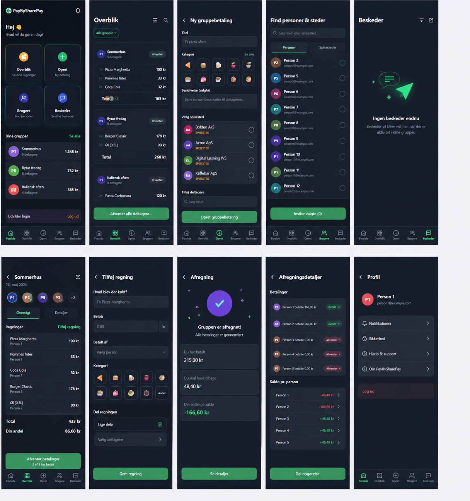
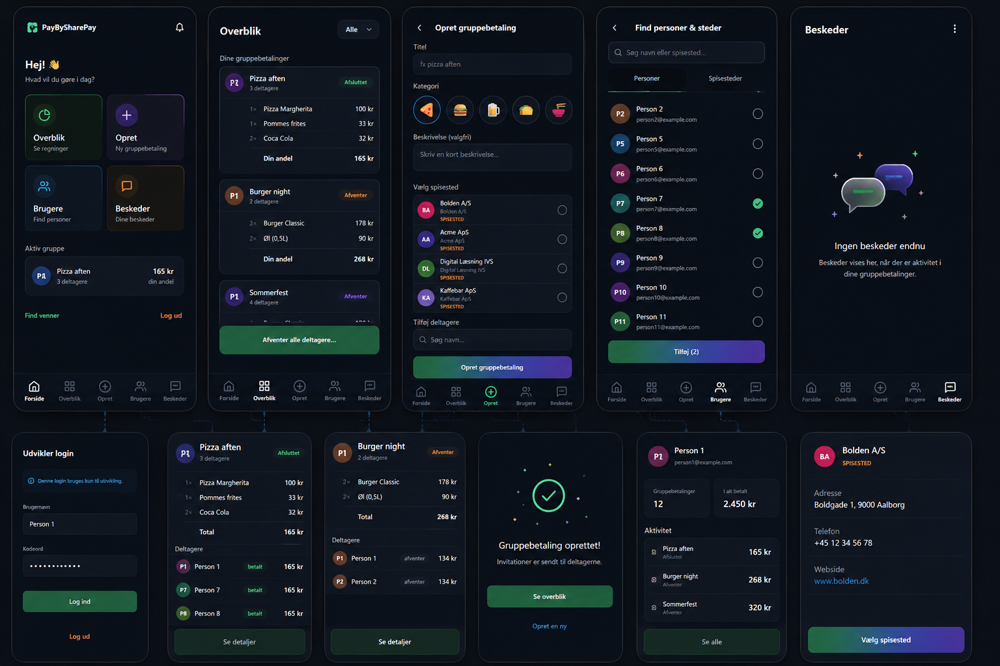

# PayBySharePay UI/UX Refactor Guide til GitHub Copilot / Claude Sonnet 4.6

Denne guide skal bruges som input til GitHub Copilot Agent / Claude Sonnet 4.6 i Visual Studio.
Formålet er at løfte PayBySharePay mobilappens UI fra en funktionel prototype til et mere professionelt, moderne og levende app-design, uden at ændre appens grundlæggende navigation og funktionalitet.

Appen skal fortsat være enkel, mørk, mobilvenlig og konsekvent på tværs af siderne. Den skal bare føles mere som en rigtig fintech/social-payment app og mindre som en teknisk prototype.

---

## Referencebilleder

Brug disse to mockup-billeder som visuel reference for den ønskede retning.

### Reference 1: samlet skærmretning



### Reference 2: flow, kort, detaljer og udvikler-login



---

## Kort designbeskrivelse til Copilot

PayBySharePay skal have et moderne dark-mode mobilinterface inspireret af apps som Splitwise, Revolut, Lunar, MobilePay og moderne expense-sharing apps. UI'et skal være mørkt, roligt og professionelt med bløde kort, diskrete gradienter, tydelig typografi, små status-badges, moderne ikoner, god luft mellem elementerne og en fast bundnavigation.

Designet skal ikke være farverigt over det hele. Det skal bruge en mørk base, en grøn primær action-farve, lilla/blå/orange sekundære accentfarver og subtile glassmorphism/gradient-effekter. Det vigtigste er, at skærmene føles som samme app, men at hver side får mere karakter og tydeligere hierarki.

---

## Overordnet mål

Refaktor UI-laget i PayBySharePay, så appen matcher referencebillederne så tæt som muligt, men uden at ødelægge eksisterende funktionalitet.

Prioritér dette:

1. Bevar eksisterende navigation og features.
2. Gør designet mere professionelt og moderne.
3. Saml farver, spacing, fontstørrelser, border radius og komponenter i fælles styles.
4. Skab genbrugelige UI-komponenter til kort, badges, avatarer, knapper, inputfelter og bundnavigation.
5. Flyt udvikler-login/log ud fra forsiden ned i et diskret udviklerpanel nederst på forsiden.
6. Gør hver skærm visuelt mere komplet, også når der ikke er data.
7. Sørg for at UI virker godt på Android mobilskærme.

---

## Vigtig regel

Lav UI-refactoren i små, sikre trin. Efter hvert trin skal appen stadig kunne bygge og starte.

Undgå store arkitekturændringer i business logic, database, API-kald eller viewmodels, medmindre det er nødvendigt for UI'et.

---

# Step 1 - Gennemgå eksisterende projekt

## Opgave

Læs eksisterende html/typescrippt/angular/C# filer og find:

- Appens eksisterende sider.
- Eksisterende styles/resources.
- Bundnavigation.
- Forside/dashboard.
- Overbliksside.
- Opret gruppebetaling-side.
- Brugere/find personer-side.
- Beskeder-side.
- Eventuelle komponenter for kort, lister, knapper og inputfelter.

## Output

Lav først en kort analyse i chatten:

- Hvilke filer skal ændres.
- Hvilke styles findes allerede.
- Hvilke komponenter bør genbruges.
- Hvilke komponenter bør oprettes.

Foretag ikke kodeændringer før analysen er lavet.

---

# Step 2 - Opret fælles design tokens

## Mål

Opret eller opdater fælles styles, så hele appen får samme visuelle sprog.

## Design tokens

Brug disse værdier som udgangspunkt:

### Farver

- App background: `#070B14` eller meget mørk navy/sort.
- Surface/card: `#101827`.
- Elevated card: `#151E2E`.
- Input background: `#121B2A`.
- Border subtle: `#263247`.
- Primary green: `#22C55E`.
- Primary green dark: `#15803D`.
- Cyan accent: `#06B6D4`.
- Purple accent: `#7C3AED`.
- Orange accent: `#F59E0B`.
- Danger/red: `#EF4444`.
- Text primary: `#FFFFFF`.
- Text secondary: `#94A3B8`.
- Text muted: `#64748B`.

### Radius

- Small radius: 8.
- Medium radius: 14.
- Large card radius: 20.
- Bottom sheet/card radius: 24.

### Spacing

- Page horizontal padding: 20 eller 24.
- Card padding: 16.
- Section spacing: 20.
- List item spacing: 12.

### Typografi

- Page title: bold, ca. 22-26.
- Section title: semibold, ca. 13-15, gerne uppercase label style.
- Body: 14-16.
- Caption: 11-13.
- Beløb/totaler: bold.

## Opgave

Saml disse værdier i fælles ResourceDictionary eller tilsvarende stilfil.

Hvis projektet allerede har AppStyles.xaml, Colors.xaml eller lignende, så opdater disse i stedet for at oprette dubletter.

---

# Step 3 - Opret genbrugelige UI-komponenter

## Mål

Undgå at hver side designer sine egne kort og knapper forskelligt.

## Opret eller refaktor disse komponenter

### 1. AppCard

Et genbrugeligt kort med:

- Mørk surface baggrund.
- Subtil border.
- Stor radius.
- Indvendig padding.
- Eventuelt svag gradient eller skygge, hvis platformen understøtter det pænt.

Bruges til gruppebetalinger, lister, profilkort, betalingsdetaljer og formularsektioner.

### 2. PrimaryButton

En grøn primær knap med:

- Fyldt grøn baggrund eller grøn gradient.
- Hvid tekst.
- Stor radius.
- God højde, cirka 50-56.
- Disabled state med mørk lilla/grå tone som i referencebilledet.

### 3. SecondaryButton / GhostButton

Diskret sekundær knap til links og mindre handlinger.

### 4. StatusBadge

Badge til status som:

- `afventer`
- `accepteret`
- `betalt`
- `afsluttet`

Badge skal være lille, afrundet og farvekodet.

Eksempel:

- Afventer: orange eller gråblå.
- Accepteret/betalt: grøn.
- Afsluttet: grøn/diskret.

### 5. AvatarCircle

Rund avatar med initialer, fx P1, P2, BA.

Avatar skal:

- Have faste størrelser.
- Kunne bruge forskellige accentfarver.
- Have tydelig hvid tekst.

### 6. EmptyState

Komponent til tomme sider, især Beskeder.

Skal have:

- Illustration/ikon.
- Overskrift.
- Kort hjælpetekst.
- Eventuel sekundær handling.

---

# Step 4 - Refaktor forsiden

## Mål

Forsiden skal føles som et rigtigt dashboard og ikke bare fire store knapper.

## Designretning

Brug referencebilledet med:

- App-logo/navn øverst.
- Lille notifikationsikon øverst til højre.
- Velkomsttekst: `Hej 👋`.
- Undertekst: `Hvad vil du gøre i dag?`.
- Fire action cards i 2x2 grid.
- Sektion med aktive grupper.
- Udvikler-login nederst som diskret panel.
- Fast bundnavigation.

## Vigtige ændringer

### Flyt udvikler-login

Det nuværende login/log ud på forsiden skal ikke fremstå som en produktionsfeature.

Flyt det til et diskret panel nederst på forsiden med titel:

`Udvikler login`

Panelet må gerne have:

- En lille info-tekst: `Denne login bruges kun til udvikling.`
- Dropdown eller input til valg af testperson.
- `Log ind` / `Log ud` handling.

Når appen senere går i produktion, skal dette panel let kunne skjules med en feature flag, build setting eller miljøvariabel.

### Action cards

De fire store kort skal være mere levende:

- Overblik: grøn/gul accent.
- Opret: grøn/lilla accent.
- Brugere: blå/cyan accent.
- Beskeder: orange/lilla accent.

Hvert kort skal have:

- Ikon i rund cirkel.
- Titel.
- Kort undertitel, fx `Se regninger`, `Ny gruppebetaling`, `Find personer`, `Dine beskeder`.
- Subtil border/gradient.

### Aktiv gruppe

Tilføj en sektion:

`Aktiv gruppe` eller `Dine grupper`

Vis 1-3 seneste grupper som små cards med:

- Avatar.
- Titel.
- Antal deltagere.
- Din andel eller totalbeløb.
- Status hvis relevant.

---

# Step 5 - Refaktor Overblik-siden

## Mål

Overblik-siden skal vise gruppebetalinger mere professionelt som cards, ikke kun som en teknisk liste.

## Designretning

Brug referencebilledet med:

- Titel `Overblik`.
- Lille filterknap, fx `Alle` eller `Alle grupper`.
- Eventuelt søg/filter-ikon øverst til højre.
- Gruppebetalinger som cards.
- Hver gruppebetaling viser titel, deltagere, status, linjer og total.
- Primær bundknap: `Afventer alle deltagere...` eller relevant handling.

## Card-indhold

Hvert gruppebetalingskort bør vise:

- Avatar/initialer.
- Titel, fx `Pizza aften`.
- Antal deltagere.
- StatusBadge.
- 2-4 varelinjer.
- Total eller `Din andel`.
- Diskret separator mellem varelinjer og total.

## UX

- Brug ikke for kraftige borders.
- Brug god luft mellem cards.
- Brug beløb højrestillet.
- Brug status-badges til hurtigt overblik.
- Brug en mindre tekstfarve til metadata.

---

# Step 6 - Refaktor Opret gruppebetaling-siden

## Mål

Formularen skal føles som en guidet og moderne oprettelsesflow.

## Designretning

Brug referencebilledet med:

- Tilbagepil øverst.
- Titel `Ny gruppebetaling` eller `Opret gruppebetaling`.
- Inputfelter i mørke afrundede felter.
- Kategori-vælger som chips med ikoner.
- Spisestedsliste som card-list.
- Deltagervælger nederst.
- Primær knap nederst.

## Felter

Formularen bør have denne rækkefølge:

1. Titel.
2. Kategori.
3. Beskrivelse/besked valgfri.
4. Vælg spisested.
5. Tilføj deltagere.
6. Opret gruppebetaling.

## Kategori UI

Kategori-knapper skal ligne små afrundede chips/cards med emoji eller ikon.

Eksempler:

- 🍕 Pizza
- 🍔 Burger
- 🍺 Drikke
- 🌮 Taco
- 🍰 Dessert
- ☕ Kaffe

Den valgte kategori skal have tydelig grøn/cyan border eller glow.

## Spisestedsliste

Hvert spisested skal vises med:

- Avatar med initialer.
- Navn.
- Type-label `SPISESTED` i orange.
- Radio/checkmark til højre.

## Primær knap

Knappen nederst skal være sticky eller tydeligt placeret nær bunden:

`Opret gruppebetaling`

Disabled state skal ligne referencebilledet: mørk lilla/grå med afdæmpet tekst.

---

# Step 7 - Refaktor Find personer & steder

## Mål

Siden skal være mere brugervenlig, især hvis den både kan finde personer og merchants/spisesteder.

## Designretning

Brug referencebilledet med:

- Titel `Find personer & steder`.
- Søgning øverst.
- Tabs: `Personer` og `Spisesteder`.
- Liste med avatar, navn, email/undertitel og check/radio til højre.
- Primær knap nederst: `Tilføj (x)` eller `Inviter valgte (x)`.

## Vigtigt krav

En deltager/bruger kan også være en merchant/virksomhed.
En merchant har bare ekstra informationer, fx:

- Firmanavn.
- CVR eller virksomheds-id hvis relevant.
- Adresse.
- Telefon.
- Website.
- Betalingsoplysninger.
- Label som `SPISESTED`, `MERCHANT` eller lignende.

UI'et skal derfor understøtte både almindelige personer og spisesteder/merchants uden at skulle ændre hele flowet.

## UX

- Brug tabs eller segmented control.
- Bevar samme listekomponent til personer og merchants.
- Brug forskellig undertitel og label afhængigt af type.
- Valgte personer skal have grøn checkmark.
- Primær knap skal vise antal valgte.

---

# Step 8 - Refaktor Beskeder-siden

## Mål

Beskeder-siden må ikke se tom eller ufærdig ud.

## Designretning

Brug referencebilledet med:

- Titel `Beskeder`.
- Eventuelt filterikon eller ny besked-ikon øverst.
- Flot empty state midt på siden.
- Illustration med talebobler eller papirflyver.
- Tekst: `Ingen beskeder endnu`.
- Undertekst: `Beskeder vises her, når der er aktivitet i dine gruppebetalinger.`

## Opgave

Implementér EmptyState-komponenten på Beskeder-siden.

Hvis der senere findes beskeder, skal siden vise beskedkort med:

- Ikon/avatar.
- Titel.
- Kort tekst.
- Tidspunkt.
- Eventuel status.

---

# Step 9 - Refaktor detaljesider

## Mål

Appen skal have professionelle detaljesider for gruppebetaling, regning, afregning og profiler.

## Skærme der bør oprettes eller forbedres

### Gruppebetaling-detalje

Vis:

- Titel.
- Dato.
- Deltager-avatarer øverst.
- Tabs: `Oversigt` og `Detaljer`.
- Regninger/varelinjer.
- Total.
- Din andel.
- Primær statusknap nederst.

### Tilføj regning

Vis:

- Input: `Hvad blev der købt?`
- Beløb.
- Betalt af.
- Kategori.
- Del regningen.
- Vælg deltagere.
- Knap: `Gem regning`.

### Afregning

Vis:

- Stor succesindikator med checkmark.
- Tekst: `Gruppen er afregnet!`
- Kort med beløb:
  - Du har betalt.
  - Du skal have tilbage.
  - Din endelige saldo.
- Knap: `Se detaljer`.

### Profil

Vis:

- Avatar.
- Navn og email.
- Statistik-cards.
- Menu-items:
  - Notifikationer.
  - Sikkerhed.
  - Hjælp & support.
  - Om PayBySharePay.
- Log ud som rød/diskret knap.

---

# Step 10 - Bundnavigation

## Mål

Bundnavigationen skal være ens på alle sider og se mere professionel ud.

## Krav

Bundnavigation skal have:

- Fast placering i bunden.
- Mørk baggrund.
- Subtil top-border.
- Ikon + tekst.
- Aktiv side med grøn accent.
- Inaktive sider med muted grå/blå.

Faner:

1. Forside
2. Overblik
3. Opret
4. Brugere
5. Beskeder

## UX

- Opret-fanen må gerne have et lidt mere fremhævet plus-ikon.
- Aktiv state skal være tydelig, men ikke skrigende.
- Tekster skal være små, men læsbare.

---

# Step 11 - Mikrointeraktioner og polish

## Mål

Gør appen mere levende uden at overdrive.

## Tilføj hvor det giver mening

- Pressed state på cards og knapper.
- Let opacity change ved tap.
- Små transitions ved valg af kategori/person.
- Checkmark animation ved valg.
- Loading state på primære knapper.
- Disabled states der tydeligt viser, at handlingen ikke kan udføres endnu.

Undgå tunge animationer der gør appen langsom.

---

# Step 12 - Responsiv mobiltest

## Mål

UI'et skal testes på relevante Android skærmstørrelser.

## Test

Kontrollér:

- 360px bredde.
- 390px bredde.
- 412px bredde.
- Små og store Android telefoner.
- Lange lister.
- Tomme sider.
- Disabled knapper.
- Keyboard åbent på formularsider.
- Bundnavigation med safe area.

## Acceptkriterier

- Ingen tekst må blive klippet uhensigtsmæssigt.
- Bundknapper må ikke skjules bag navigationen.
- Formularer skal kunne scrolles.
- Cards skal have ens padding og radius.
- Farver skal være læsbare i dark mode.

---

# Step 13 - Oprydning og færdiggørelse

## Opgave

Når UI-refactoren er færdig:

1. Fjern døde styles.
2. Fjern dubletter.
3. Sørg for at navne på styles/komponenter er forståelige.
4. Sørg for at eksisterende funktionalitet stadig virker.
5. Sørg for at appen bygger uden fejl.
6. Lav en kort opsummering af ændrede filer.

## Output til mig

Når du er færdig, skriv:

- Hvilke filer du har ændret.
- Hvilke nye komponenter du har oprettet.
- Hvilke skærme der er refaktoreret.
- Om der er noget funktionalitet, jeg bør teste manuelt.

---

# Prompt jeg kan give til Copilot

Kopiér denne prompt ind i Copilot Agent / Claude Sonnet 4.6 sammen med denne markdown-fil og referencebillederne:

```text
Du skal refaktorere UI/UX i PayBySharePay mobilappen ud fra filen PayBySharePay-UI-UX-Copilot-Guide.md og de to referencebilleder.

Målet er ikke at ændre forretningslogik, database, API eller navigation unødvendigt. Målet er at løfte UI'et, så appen matcher referencebillederne: moderne dark-mode, professionelle cards, grøn primær accent, tydelig typografi, bedre spacing, status badges, avatarer, bedre tomme states og en mere komplet forside.

Start med at analysere projektets eksisterende UI-filer og fortæl hvilke filer du vil ændre. Derefter udfører du guiden step by step i naturlig rækkefølge. Efter hvert større step skal projektet fortsat kunne bygge.

Vigtigt:
- Bevar eksisterende funktionalitet.
- Flyt udvikler-login/log ud på forsiden ned i et diskret udviklerpanel nederst på forsiden.
- Brug fælles styles/design tokens i stedet for hardcodede farver overalt.
- Opret genbrugelige komponenter til cards, knapper, badges, avatarer og empty states.
- Gør Beskeder-siden professionel med empty state.
- Gør Find personer & steder klar til både almindelige personer og merchants/spisesteder.
- Sørg for at UI virker godt på Android mobilskærme.

Når du laver kodeændringer, så vis hele filen for de filer du ændrer, ikke kun små uddrag.
```

---

# Definition of Done

UI-refactoren er færdig, når:

- Forsiden ligner et moderne dashboard.
- Udvikler-login er flyttet til bunden og føles diskret.
- Overblik-siden bruger professionelle gruppebetaling-cards.
- Opret-siden har moderne formular, kategori-chips og spisestedsliste.
- Brugere-siden understøtter både personer og merchants/spisesteder i samme visuelle system.
- Beskeder-siden har en flot empty state.
- Bundnavigation er ens, mørk og professionel på alle sider.
- Farver, spacing, radius og typografi styres fra fælles styles.
- Appen bygger og eksisterende funktionalitet virker.
