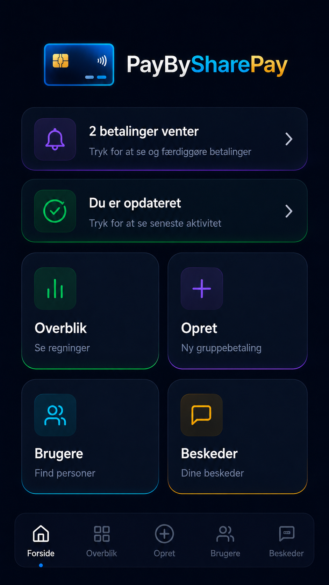
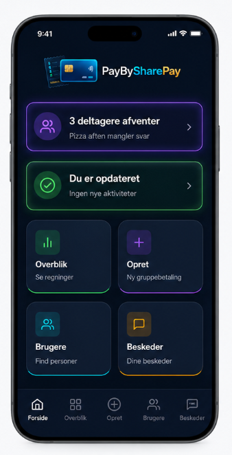
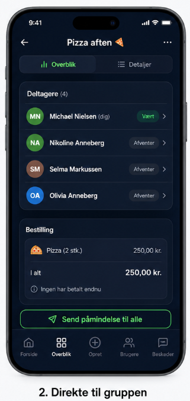

# PayBySharePay – Ny forside og statuskort-flow

Denne guide skal bruges som input til **Visual Studio Copilot / Claude Sonnet 4.6**.
Formålet er at ændre PayBySharePay-forsiden, så den matcher det nye design, og så statuskortet **“3 deltagere afventer”** åbner direkte til den relevante gruppes statusside uden et ekstra mellemled.

## Referencebilleder

Brug disse billeder som visuelle krav:

### 1. Gammel forside – skal erstattes



### 2. Ny forside – ønsket design



### 3. Statusside – åbnes direkte ved klik på “3 deltagere afventer”



---

## Overordnet mål

Forsiden skal være mere handlingsorienteret.
Brugeren skal straks kunne se, om der er noget vigtigt i gang, og kunne trykke direkte videre til den konkrete gruppe.

Den gamle forside med “Hej, Michael Nielsen” og knappen “Se alle grupper” skal erstattes af en mere kompakt forside med:

- Logo øverst med kreditkort-ikon til venstre og teksten **PayBySharePay** til højre.
- Statuskort øverst.
- Fire primære funktionskort: **Overblik**, **Opret**, **Brugere**, **Beskeder**.
- Bundnavigation som i eksisterende app.

---

## Vigtig UX-beslutning

Der må **ikke** laves en ekstra mellem-side eller bottom sheet, når man klikker på **“3 deltagere afventer”**.

Klikket skal gå direkte til gruppens eksisterende statusside/overbliksside, som vist på referencebillede 3.

Begrundelse:

- Brugeren har allerede en god overbliksside.
- Et mellemled gentager bare samme information.
- Direkte navigation er hurtigere og mere logisk.

---

## Funktionalitet der skal udvikles

## Step 1 – Find eksisterende struktur

Start med at undersøge den eksisterende løsning.
Find de filer/komponenter/sider der svarer til:

- Forside / Home / Dashboard
- Overblik / gruppeoversigt
- Statusside for en konkret gruppe/order
- Bundnavigation
- Eksisterende data-model for grupper, deltagere, betalinger og status

Lav først en kort plan i Copilot, før du ændrer kode.

### Copilot-opgave

Find den eksisterende forside og gruppestatusside. Beskriv kort hvilke filer der skal ændres, og hvorfor.

---

## Step 2 – Erstat gammel forside med ny forside

Den gamle forside skal ændres, så den visuelt matcher referencebillede 2.

### Fjern fra forsiden

Fjern eller skjul følgende elementer fra den gamle forside:

- Teksten **“Hej, Michael Nielsen”**
- Teksten **“Hvad vil du gøre i dag?”**
- Knappen **“Se alle grupper”**
- Eventuel udvikler-login boks nederst, hvis den ikke længere skal være synlig på forsiden

### Tilføj/bevar på forsiden

Forsiden skal indeholde:

1. **Logo/header**
   - Kreditkort-ikon til venstre.
   - Teksten **PayBySharePay** til højre for kreditkortet.
   - Logoet skal være centreret som samlet enhed på siden.
   - Det må ikke fylde for meget vertikalt.

2. **Statuskort 1**
   - Titel: `3 deltagere afventer`
   - Undertekst: `Pizza aften mangler svar`
   - Ikon: deltagere/personer
   - Accentfarve: lilla
   - Chevron/højrepil i højre side
   - Klik åbner direkte status/overblik for gruppen **Pizza aften**

3. **Statuskort 2**
   - Titel: `Du er opdateret`
   - Undertekst: `Ingen nye aktiviteter`
   - Ikon: checkmark/status
   - Accentfarve: grøn
   - Chevron/højrepil i højre side
   - Klik kan senere åbne aktivitetslog/notifikationer. I denne opgave er det nok at navigere til eksisterende beskeder/aktivitet, hvis den side findes. Hvis den ikke findes, skal der ikke bygges en stor ny funktion.

4. **Funktionskort**
   - `Overblik` / `Se regninger`
   - `Opret` / `Ny gruppebetaling`
   - `Brugere` / `Find personer`
   - `Beskeder` / `Dine beskeder`

5. **Bundnavigation**
   - Forside
   - Overblik
   - Opret
   - Brugere
   - Beskeder

---

## Step 3 – Datagrundlag for statuskortet “3 deltagere afventer”

Statuskortet skal ikke være statisk på sigt.
Det skal baseres på aktive grupper/orders.

For denne opgave må der gerne startes simpelt, men strukturen skal være klar til rigtige data.

### Krav

Find den gruppe/order der har aktive deltagere som afventer.
Eksempel:

- Gruppe: `Pizza aften`
- Antal deltagere: `4`
- Vært: `Michael Nielsen`
- Afventende deltagere:
  - Nikoline Annenberg
  - Selma Markussen
  - Olivia Annenberg

Forsidekortet skal vise:

```text
3 deltagere afventer
Pizza aften mangler svar
```

Hvis der ikke findes afventende deltagere, skal kortet enten skjules eller vise en neutral status.
Eksempel:

```text
Du er opdateret
Ingen deltagere afventer
```

Vælg den løsning der passer bedst til eksisterende kodebase.

---

## Step 4 – Klik på “3 deltagere afventer”

Når brugeren klikker på statuskortet **“3 deltagere afventer”**, skal appen navigere direkte til statussiden for den relevante gruppe/order.

Der må ikke vises:

- Bottom sheet
- Pop-up
- Ekstra liste
- Mellemled

### Forventet navigation

```text
Forside
  -> klik på “3 deltagere afventer”
  -> Statusside for Pizza aften
```

Statussiden skal ligne referencebillede 3.

---

## Step 5 – Statusside for gruppen

Statussiden skal vise den konkrete gruppe/order.

### Header

- Tilbage-pil øverst til venstre
- Titel: `Pizza aften 🍕`
- Menuikon øverst til højre

### Tabs

- `Overblik` aktiv
- `Detaljer` inaktiv

### Deltagere

Vis deltagerkort/liste:

```text
Michael Nielsen (dig)    Vært
Nikoline Annenberg       Afventer
Selma Markussen          Afventer
Olivia Annenberg         Afventer
```

### Bestilling

Vis bestilling:

```text
Pizza (2 stk.)       250,00 kr.
I alt                250,00 kr.
Ingen har betalt endnu
```

### Primær handling

Nederst på statussiden skal der være en tydelig knap:

```text
Send påmindelse til alle
```

Knappen skal kunne kobles til eksisterende besked/notifikationslogik, hvis den findes.
Hvis besked/notifikation endnu ikke findes, skal der laves en tydelig placeholder-metode/service, så funktionaliteten nemt kan implementeres senere.

---

## Step 6 – “Du er opdateret”-kortet

Kortet **“Du er opdateret”** er et informationskort.
Det skal ikke konkurrere med Overblik-siden.

### Anbefalet adfærd i denne opgave

Hvis der findes en eksisterende side for aktivitet eller beskeder:

```text
Klik -> Aktivitet/Beskeder
```

Hvis der ikke findes en aktivitetsside:

```text
Klik -> Beskeder
```

Der skal ikke bygges en helt ny stor aktivitetsfunktion i denne opgave, medmindre projektet allerede har en naturlig side til det.

---

## Step 7 – Visuelle krav

Designet skal matche referencebillede 2 og 3 så tæt som muligt.

### Layout

- Mobil-first design.
- Mørk baggrund.
- Store afrundede kort.
- Neon-lignende kant/accent på kort.
- God afstand mellem elementer.
- Logo øverst må gerne være større end i den gamle forside, men skal stadig være kompakt.
- Statuskort skal fylde hele bredden.
- Funktionskort skal ligge i 2 x 2 grid.

### Farver/tema

Brug eksisterende farver hvis de findes i projektet.
Ellers brug samme visuelle retning:

- Baggrund: næsten sort / navy
- Kort: mørk blå/sort
- Grøn accent til Overblik/status OK
- Lilla accent til Opret/afventer
- Cyan accent til Brugere
- Gul/orange accent til Beskeder

### Tekst

Brug dansk tekst i UI.
Tekster skal være korte og handlingsorienterede.

---

## Step 8 – Acceptkriterier

Opgaven er færdig når følgende virker:

- Den gamle forside er erstattet af den nye forside.
- Logoet står øverst med kortikon til venstre og **PayBySharePay** til højre.
- Teksterne **“Hej, Michael Nielsen”** og **“Hvad vil du gøre i dag?”** er fjernet.
- Knappen **“Se alle grupper”** er fjernet.
- Forsiden viser statuskortet **“3 deltagere afventer”**.
- Forsiden viser statuskortet **“Du er opdateret”**.
- Forsiden viser de fire funktionskort.
- Klik på **“3 deltagere afventer”** åbner direkte gruppestatussiden for **Pizza aften**.
- Der vises ikke et mellemled/bottom sheet mellem forsiden og statussiden.
- Statussiden viser deltagere, status, bestilling og knappen **“Send påmindelse til alle”**.
- Bundnavigation fungerer stadig.
- Løsningen bygger uden fejl.
- Eksisterende tests må ikke ødelægges.

---

## Step 9 – Testscenarier

Lav eller opdater tests hvor det giver mening i projektet.
Hvis UI-test ikke findes, så lav minimum testbar kode i viewmodel/service-lag.

### Test 1 – Statuskort viser korrekt antal

Givet en gruppe med 3 deltagere der afventer.
Når forsiden indlæses.
Så vises teksten:

```text
3 deltagere afventer
```

### Test 2 – Statuskort viser korrekt gruppe

Givet gruppen `Pizza aften` har deltagere der afventer.
Når forsiden indlæses.
Så vises teksten:

```text
Pizza aften mangler svar
```

### Test 3 – Klik navigerer direkte til gruppe

Givet statuskortet `3 deltagere afventer` vises på forsiden.
Når brugeren klikker på kortet.
Så navigeres direkte til statussiden for den relevante gruppe/order.

### Test 4 – Ingen mellemled

Når brugeren klikker på statuskortet.
Så må der ikke åbnes en bottom sheet, modal eller ekstra liste før statussiden.

### Test 5 – Statusside viser deltagere

Når statussiden for `Pizza aften` åbnes.
Så vises:

- Michael Nielsen som vært
- Nikoline Annenberg som afventer
- Selma Markussen som afventer
- Olivia Annenberg som afventer

---

# Prompt til Visual Studio Copilot Claude Sonnet 4.6

Kopiér denne prompt ind i Copilot, når filen og billederne ligger i projektet:

```text
Læs filen PayBySharePay-Forside-Statuskort-Copilot-Guide.md og brug referencebillederne som visuelle krav.

Opgaven er at ændre PayBySharePay-forsiden, så den matcher den nye forside i referencebillede 2, og at klik på statuskortet “3 deltagere afventer” åbner direkte statussiden for gruppen “Pizza aften” som vist i referencebillede 3.

Vigtigt:
- Lav ikke et mellemled, bottom sheet eller pop-up mellem forsiden og statussiden.
- Genbrug eksisterende sider, komponenter, navigation, services og modeller hvor det er muligt.
- Find først de relevante filer i løsningen.
- Skriv først en kort implementeringsplan med hvilke filer du vil ændre.
- Implementér derefter ændringerne trin for trin.
- Når du ændrer kode, så vis hele filen og ikke kun uddrag.
- Bevar eksisterende funktionalitet og bundnavigation.
- Byg løsningen til sidst og ret eventuelle fejl.
- Opdater eller tilføj tests hvor det giver mening.

Start med Step 1 og Step 2 fra guiden. Stop efter implementeringsplanen, hvis du er usikker på eksisterende navigation eller datamodel.
```

---

## Anbefalet arbejdsgang

1. Læg denne `.md`-fil i projektets `docs`-mappe.
2. Læg de tre billeder i samme mappe som `.md`-filen.
3. Åbn Visual Studio 2026.
4. Åbn Copilot Chat med Claude Sonnet 4.6.
5. Indsæt prompten ovenfor.
6. Bed Copilot om at implementere én del ad gangen.
7. Kør build efter hver større ændring.
8. Sammenlign UI med referencebillede 2 og 3.
